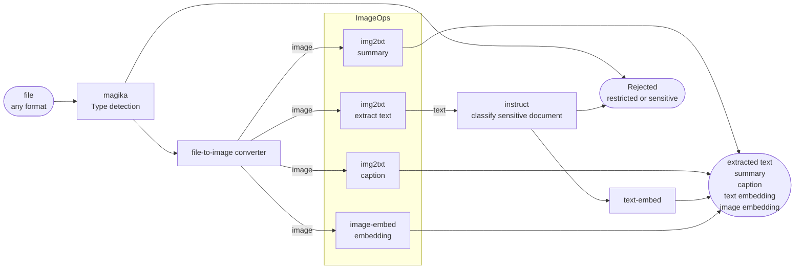
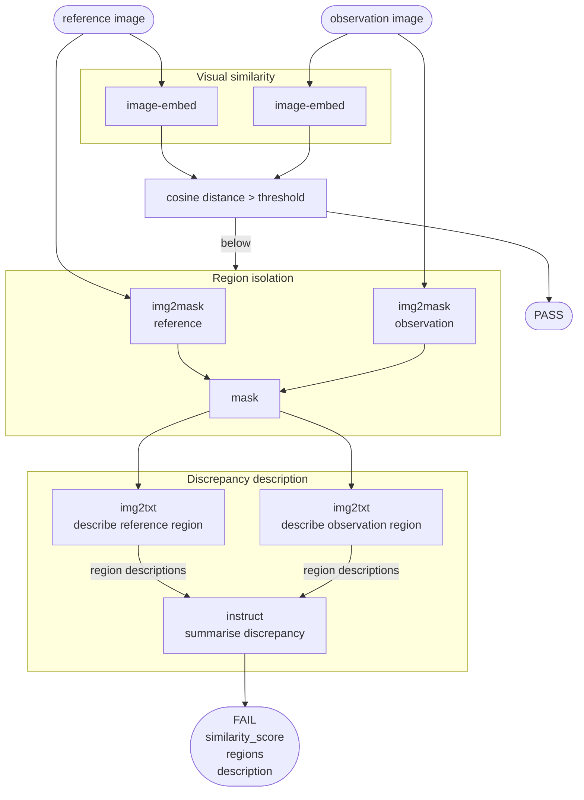
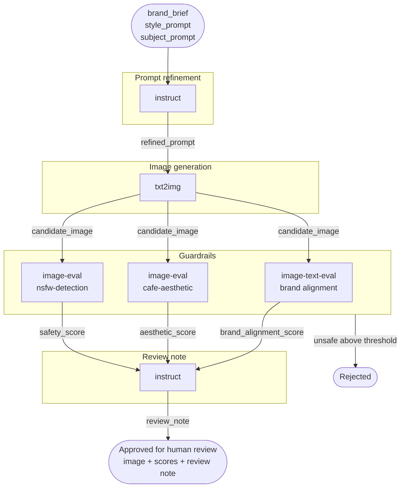

# Marigold -- Workflow Examples

This document describes use-cases that can be composed from the model types
available in Marigold. Each example is a sequence of model calls where the
output of one step feeds the input of the next. These are intended to serve
as the basis for a formal workflow definition format.

A workflow is a directed graph of inference steps. Each step specifies:

- the model type and model name to call
- the input field mapping (which output from a prior step, or from the
  workflow input, becomes the input to this step)
- any conditional logic (branch on a score threshold, halt on a flag)
- the output field to surface or pass forward

The examples below describe the steps, data flow, and intended application
for each workflow.


---

## 1. Content ingestion and moderation pipeline

**Use-case**: Bulk ingestion of business documents (presentations, reports,
scanned forms, images) into a searchable knowledge base with automated
classification to prevent restricted content -- HR records, legal documents,
financial filings -- from reaching the index.

Steps:
```
[input: file (any format)]
  -> magika           file type detection
                      branch: if unknown type -> halt, flag as rejected

  -> file-to-image    decode to image representation
                      (PDF pages, Office documents, plaintext, images)

  -> img2txt          model: paligemma
                      prompt: "Extract all text visible in this image."
                      output: extracted_text

  -> img2txt          model: paligemma
                      prompt: "Summarise the content of this document
                               in three sentences."
                      output: summary
                      (parallel with extraction and captioning)

  -> img2txt          model: paligemma
                      prompt: "Write a single sentence caption describing
                               this document."
                      output: caption
                      (parallel with extraction and summary)

  -> image-embed      model: clip-ViT-B-32
                      input: decoded image
                      output: image embedding vector
                      (parallel with extraction, summary, captioning)

  -> instruct         model: qwen2-1.5b
                      prompt: "Classify this document. Categories:
                               project, HR, legal, finance, other.
                               Respond with the category only.
                               Document: {extracted_text}"
                      output: document_category
                      branch: if HR / legal / finance -> halt, flag as restricted

  -> text-embed       model: paraphrase-multilingual-mpnet-base-v2
                      input: extracted_text
                      output: text embedding vector

[output: extracted text, summary, caption, text embedding, image embedding]
```

**Why this differs from conventional automation tools**:
Every decision in the pipeline is a model inference. The file type gate uses
a trained classifier rather than extension matching or MIME sniffing. The
document category gate uses an instruction-following model rather than a
keyword list or regex, which means it handles paraphrased or ambiguous
document titles correctly. The caption and summary are generated from the
visual representation of the document, so the pipeline handles scanned PDFs,
photographed whiteboards, and formatted presentations without separate
processing paths.

The four vision operations (extract, summarise, caption, embed) run in
parallel on the same decoded image, and both the text and image are embedded
into comparable vector spaces. This enables cross-modal search: a text query
can retrieve a slide deck based on its visual content, and an image query can
retrieve documents whose text matches the image semantics. No bespoke
integration is required between the text and image retrieval paths.



---

## 2. Quality-gated image generation

**Use-case:** Automated generation of product imagery or creative assets
where output must meet aesthetic and safety thresholds before being accepted.

**Steps:**

```
[input: prompt text, quality_threshold, max_attempts]
  -> txt2img         model: stable-diffusion-v1-5
                     output: image

  -> image-eval      model: nsfw-image-detection
                     output: scores
                     branch: if unsafe > 0.3 -> retry txt2img with
                             amended prompt ("safe for work, " + original)

  -> image-eval      model: cafe-aesthetic
                     output: scores { aesthetic }
                     branch: if aesthetic < quality_threshold
                             and attempts < max_attempts -> retry

  -> image-text-eval model: clip-ViT-B-32
                     input: generated image + original prompt
                     output: alignment score
                     branch: if alignment < 0.2 -> retry

[output: accepted image, scores, attempt count]
```

**Notes:**

The retry loop with amended prompts is not achievable in general-purpose
automation tools without custom code. The acceptance criteria are entirely
model-derived. The alignment check catches generations that are technically
safe and aesthetic but have drifted from the prompt.


---

## 3. Multilingual audio briefing generator

**Use-case:** Scheduled generation of audio summaries from structured text
data (reports, alerts, status updates) in multiple languages.

**Steps:**

```
[input: report text, target_languages: [eng, cym, deu, fra]]
  -> instruct        model: qwen2-1.5b
                     prompt: "Summarise the following in 3 sentences: {text}"
                     output: summary text (in source language)

  -> for each target_language:
       instruct      model: qwen2-1.5b
                     prompt: "Translate to {language}: {summary}"
                     output: translated summary

       tts           model: mms-tts-{language}
                     input: translated summary
                     output: audio (mp3)

[output: audio file per language]
```

**Notes:**

The translation and synthesis steps can run in parallel across languages once
the summary is produced. The Welsh language output (mms-tts-cym) is a specific
capability absent from most commercial text-to-speech services. Applied to
public sector communications, accessibility tooling, or broadcasting workflows.


---

## 4. Document visual extraction and Q&A

**Use-case:** Processing scanned documents, forms, or photographed pages to
extract information and answer structured questions about the content.

**Steps:**

```
[input: document image (scan or photograph), questions: [str]]
  -> img2txt         model: paligemma
                     prompt: "Extract all text visible in this image."
                     output: extracted text

  -> for each question:
       instruct      model: phi-3-mini
                     prompt: "Given this document text: {extracted_text}
                              Answer the following question: {question}"
                     output: answer text

  -> text-embed      model: paraphrase-multilingual-mpnet-base-v2
                     input: extracted text
                     output: embedding (for downstream indexing)

[output: extracted text, answers per question, document embedding]
```

**Notes:**

No OCR service dependency. The same pipeline handles typed documents,
handwritten notes, and photographed signage without configuration changes,
since the img2txt model generalises across visual text formats.


---

## 5. Visual conformance checking

**Use-case:** Quality assurance in manufacturing and assembly environments
where an observation image must be checked against a known good reference.
Applied to component placement, assembly completeness, surface inspection,
and shelf or workstation compliance. The pipeline produces a pass/fail
decision and, on failure, a natural-language description of the discrepancy.

**Steps:**
```
[input: reference_image, observation_image, similarity_threshold]
  -> image-embed     model: DINOv2
                     input: reference_image
                     output: embedding_reference

  -> image-embed     model: DINOv2
                     input: observation_image
                     output: embedding_observation

  -> cosine distance (non-model step)
                     inputs: embedding_reference, embedding_observation
                     output: similarity_score
                     branch: if similarity_score >= threshold -> PASS

  -> img2mask        model: SAM
                     input: reference_image
                     output: reference_mask

  -> img2mask        model: SAM
                     input: observation_image
                     output: observation_mask
                     (parallel with reference masking)

  -> mask diff       (non-model step)
                     inputs: reference_mask, observation_mask
                     output: non-conformant region crops

  -> img2txt         model: paligemma
                     input: reference region crop
                     prompt: "Describe the content of this region."
                     output: reference_description

  -> img2txt         model: paligemma
                     input: observation region crop
                     prompt: "Describe the content of this region."
                     output: observation_description
                     (parallel with reference description)

  -> instruct        model: qwen2-1.5b
                     prompt: "Given these two descriptions of the same
                              region, summarise the discrepancy.
                              Reference: {reference_description}
                              Observation: {observation_description}"
                     output: discrepancy_description

[output: PASS with similarity_score,
         or FAIL with similarity_score, regions, discrepancy_description]
```

**Notes:**

DINOv2 is used for the similarity step rather than CLIP. DINOv2 embeddings
are sensitive to visual and spatial differences -- a moved component, a
missing fastener, a misaligned part -- whereas CLIP embeddings capture
semantic meaning and would not reliably detect physical changes within a
scene of otherwise similar content.

The SAM segmentation step runs in parallel on both images. The mask diff
isolates the specific regions that differ, and those crops are passed to
the description step rather than the full images. This keeps the
discrepancy description focused on the actual non-conformant area rather
than the whole scene.

The two img2txt calls describe the same region in each image independently.
The instruct step then receives both descriptions and produces a single
summary of the discrepancy. This approach works with any single-image
vision model and does not require multi-image input support.

The cosine distance and mask diff steps are non-model operations. They
reinforce that the workflow executor must accommodate mathematical
transformations and preprocessing steps alongside model calls.



---

## 6. Spatial reconstruction from photography

**Use-case:** Extracting structural or dimensional information from
photographs without specialist survey equipment. Applied to architecture,
civil engineering assessment, agricultural monitoring, and environmental
documentation.

**Steps:**

```
[input: image]
  -> depth           model: dpt-dinov2-small-kitti
                     output: depth map (png)

  -> img2mask        model: sam-vit-huge
                     input: original image
                     output: segmentation mask (png)

  -> img2txt         model: paligemma
                     input: original image
                     prompt: "Identify the main structural elements and
                              estimate their relative scale."
                     output: structural description

  -> [future] img2mesh
                     input: original image + depth map
                     output: 3D mesh

[output: depth map, segmentation mask, structural description, mesh]
```

**Notes:**

The depth map and segmentation mask together give per-pixel depth and
per-region identity. Feeding both into a mesh reconstruction step produces
a textured 3D model from a single photograph. The structural description
provides a human-readable annotation of what the mesh represents.

This pipeline has no direct equivalent in commercial automation platforms.
The combination of depth estimation, segmentation, and captioning applied
to unstructured field photography creates a structured spatial record from
the cheapest possible sensor (a mobile phone camera).


---

## 7. Creative asset generation with semantic validation

**Use-case:** Generating branded creative assets (illustrations, product
visualisations, marketing imagery) with automated checks for brand alignment,
prompt adherence, and content safety before human review.

**Steps:**

```
[input: brand_brief (text), style_prompt, subject_prompt]
  -> instruct        model: qwen2-1.5b
                     prompt: "Write a concise image generation prompt
                              for: {brand_brief}. Style: {style_prompt}.
                              Subject: {subject_prompt}."
                     output: refined_prompt

  -> txt2img         model: stable-diffusion-v1-5
                     input: refined_prompt
                     output: candidate_image

  -> image-text-eval model: clip-ViT-B-32
                     input: candidate_image + brand_brief
                     output: brand_alignment_score

  -> image-eval      model: cafe-aesthetic
                     output: aesthetic_score

  -> image-eval      model: nsfw-image-detection
                     output: safety_score

  -> instruct        model: phi-3-mini
                     prompt: "Given alignment={brand_alignment_score},
                              aesthetic={aesthetic_score},
                              safety={safety_score},
                              write a one-sentence review of this
                              candidate asset for human approval."
                     output: review_note

[output: image, scores, review_note, ready_for_human_review flag]
```

**Notes:**

The final instruct step produces a concise reviewer note that surfaces the
numerical scores as a natural-language judgement. Human reviewers receive
an image, a brief note, and a recommendation rather than raw scores. The
pipeline can route directly to an approval queue or a rejection bin based
on combined score thresholds, with human review reserved for borderline cases.





---

## 8. Accessibility description service

**Use-case:** Generating alt-text, audio descriptions, and translated
captions for images in content management systems, publishing workflows,
or public-sector digital services.

**Steps:**

```
[input: image, target_languages: [eng, ...], verbosity: short|full]
  -> image-eval      model: nsfw-image-detection
                     branch: if unsafe -> substitute placeholder description

  -> img2txt         model: paligemma
                     prompt (short): "Describe this image in one sentence
                                      suitable for alt-text."
                     prompt (full):  "Describe this image in detail,
                                      including colours, composition, and
                                      any text visible."
                     output: base_description

  -> for each target_language (if not source language):
       instruct      model: qwen2-1.5b
                     prompt: "Translate to {language}: {base_description}"
                     output: translated_description

       tts           model: mms-tts-{language}
                     input: translated_description
                     output: audio_description

[output: base_description, translated descriptions, audio files per language]
```

**Notes:**

Applied to a CMS publishing pipeline, this runs on every image asset at
upload time or on a scheduled batch over existing content. The output meets
WCAG requirements for alternative text and audio description simultaneously,
across multiple languages, from a single image input.


---

## 9. Batch sentiment and topic analysis

**Use-case:** Processing large volumes of short text (social media, support
tickets, survey responses) to produce structured sentiment and similarity
clusters without a dedicated analytics platform.

**Steps:**

```
[input: texts: [str], cluster_count: int]
  -> for each text:
       text-eval     model: distilbert-sst2
                     output: sentiment scores { positive, negative }

       text-embed    model: all-minilm-l6-v2
                     output: embedding vector

  -> [post-processing, no model call]
       cluster embeddings using k-means (cluster_count)
       assign cluster label to each text

  -> for each cluster:
       instruct      model: qwen2-1.5b
                     prompt: "These texts share a common theme.
                              Name the theme in 3 words: {sample_texts}"
                     output: cluster_label

[output: per-text sentiment, per-text cluster assignment, cluster labels]
```

**Notes:**

The clustering step is conventional k-means over embedding vectors, not a
model call. The workflow definition format will need to accommodate
non-inference steps (aggregations, transformations, fan-in from parallel
branches) alongside model calls. The instruct step at the end converts
cluster centroids into human-readable labels without manual inspection.


---

## 10. Scheduled site or asset monitoring report

**Use-case:** Periodic (daily, weekly) automated report on a set of monitored
locations or assets, combining visual change detection with natural-language
summary and audio delivery.

**Steps:**

```
[input: image_archive (keyed by location + timestamp), report_date, languages]
  -> for each location:
       retrieve most recent two images (t-1, t-0)

       image-embed x2  -> similarity_score (as in Example 5)

       if similarity_score < threshold:
         img2txt       prompt: "Describe any changes visible between
                                yesterday and today."
                       output: change_note
       else:
         change_note = "No significant change detected."

  -> instruct          model: qwen2-1.5b
                       prompt: "Write a brief monitoring report for
                                {report_date} covering these locations
                                and observations: {location_notes}"
                       output: report_text

  -> for each language:
       tts             output: audio_report

[output: per-location change notes, written report, audio report per language]
```

**Notes:**

The full pipeline runs on a CloudWatch Events schedule. New images are
delivered to S3 by cameras or field workers. The report is generated, written
to S3, and the audio versions are produced and distributed -- all without
human involvement unless a change is flagged above a threshold.

This is the clearest expression of what distinguishes Marigold workflows from
conventional automation: every decision, description, and summary in the
pipeline is a model inference. The workflow does not route pre-existing data;
it generates new structured knowledge from raw visual input.

---

## 11. Semantic change detection

**Use-case:** Monitoring a location or environment for the appearance or
disappearance of objects over time. Applied to security (an unattended bag
has appeared), retail (a product has been removed from a shelf), logistics
(a vehicle or asset is present that was not before), and site monitoring
(new equipment or obstruction has appeared).

**Steps:**
```
[input: image_before, image_after, similarity_threshold]
  -> image-embed     model: DINOv2
                     input: image_before
                     output: embedding_before

  -> image-embed     model: DINOv2
                     input: image_after
                     output: embedding_after
                     (parallel with image_before embedding)

  -> cosine distance (non-model step)
                     inputs: embedding_before, embedding_after
                     output: similarity_score
                     branch: if similarity_score >= threshold -> no change

  -> instruct        model: qwen2-1.5b
                     prompt: "An image has changed. Before: {caption_before}.
                              After: {caption_after}.
                              Describe what has appeared or disappeared."
                     output: change_description

  -> img2txt         model: paligemma
                     input: image_before
                     prompt: "Describe the objects and their positions."
                     output: caption_before

  -> img2txt         model: paligemma
                     input: image_after
                     prompt: "Describe the objects and their positions."
                     output: caption_after
                     (parallel with caption_before)

[output: similarity_score, change_description (if changed)]
```

**Notes:**

DINOv2 embeddings are sensitive to the appearance and disappearance of
objects in a scene. A low similarity threshold catches minor changes such
as a repositioned item; a high threshold catches only substantial
differences such as a new object entering the frame. Cost is proportional
to event frequency -- the captioning and description steps only run when
a change is detected.

The two img2txt calls run in parallel and describe each image independently
in terms of objects and positions. The instruct step receives both
descriptions and identifies what has appeared or disappeared between them,
producing a natural-language summary such as "a red bag has appeared near
the left pillar" without requiring multi-image model support.


---

## Workflow definition format (draft)

The following is a sketch of how the above examples could be expressed as
declarative workflow definitions. This is not yet implemented.

```yaml
name: content-moderation
steps:
  - id: safety_check
    type: image-eval
    model: Falconsai/nsfw_image_detection
    input:
      image: $.input.image
    branch:
      - condition: "scores.unsafe > 0.7"
        action: halt
        result: { status: rejected, reason: safety }

  - id: caption
    type: img2txt
    model: google/paligemma-3b-pt-224
    input:
      image: $.input.image
    depends_on: [safety_check]

  - id: caption_eval
    type: text-eval
    model: unitary/toxic-bert
    input:
      text: $.caption.output.text
    depends_on: [caption]
    branch:
      - condition: "scores.toxic > 0.5"
        action: halt
        result: { status: rejected, reason: caption_toxicity }

  - id: text_embedding
    type: text-embedding
    model: sentence-transformers/paraphrase-multilingual-mpnet-base-v2
    input:
      text: $.caption.output.text
    depends_on: [caption_eval]

  - id: image_embedding
    type: image-embedding
    model: clip-ViT-B-32
    input:
      image: $.input.image
    depends_on: [safety_check]

outputs:
  caption: $.caption.output.text
  text_embedding: $.text_embedding.output.embedding
  image_embedding: $.image_embedding.output.embedding
  status: accepted
```

Key concepts in the format:

- `$.input.*` references the workflow input fields
- `$.{step_id}.output.*` references a named output from a prior step
- `depends_on` declares execution ordering; steps without dependencies
  can run in parallel
- `branch` declares conditional exits with a result payload
- `action: halt` terminates the workflow at that step with the given result
- `action: goto` (not shown) redirects to another step by id, enabling loops
