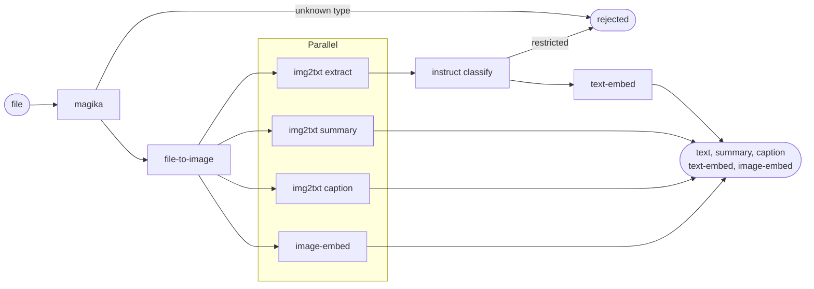
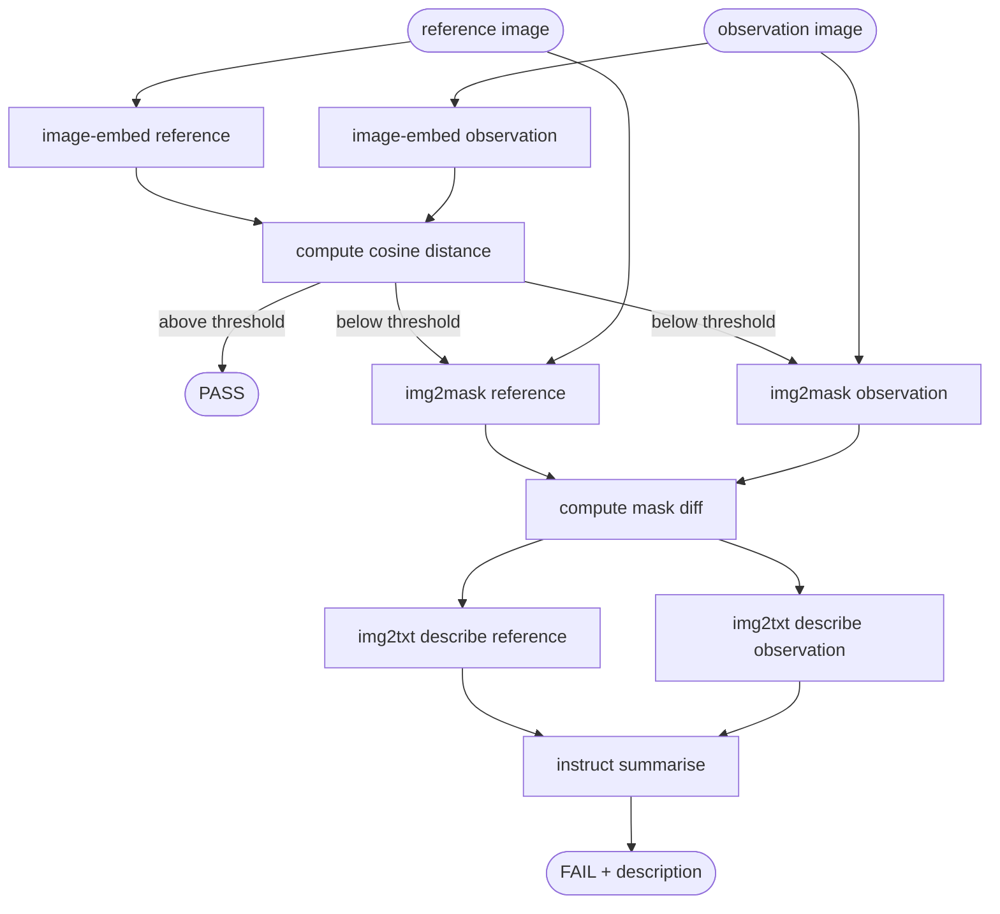
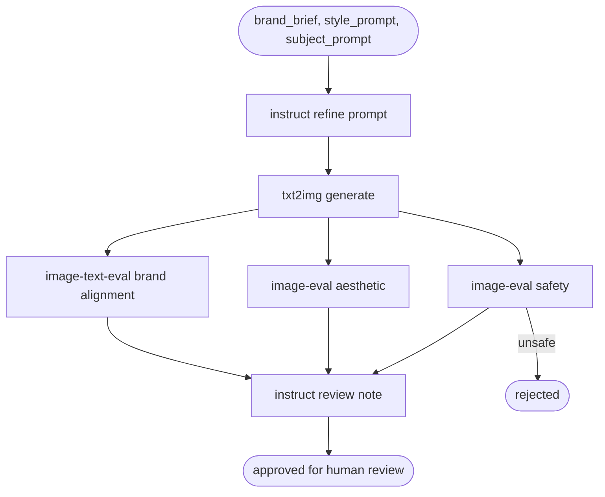

# Marigold -- Workflow Examples

Workflows are directed graphs of inference steps defined as runfox YAML specs.
Each step declares an `op` (the step identity and human-readable label),
inputs (literals, workflow input references, or prior step output references),
optional dependencies, and optional branch conditions.


## Workflows as task specifications

A workflow is two things simultaneously: a processing pipeline and a partial
task specification.

The pipeline half is the YAML -- the steps, the model choices, the dependency
graph. The specification half is implicit: the structure of the workflow
encodes assumptions about what the task requires, which models are appropriate
for each stage, and what the output should look like.

Making that second half explicit is what evals do. For each workflow, a
companion eval library defines what good output looks like for a representative
sample of inputs. Outputs from production runs can be inspected, corrected,
and returned as labelled examples. Each correction refines the specification.
The pipeline and the eval library together constitute a complete, improvable
task definition: here is how we process the data, and here is how we know
whether we processed it correctly.

The examples below are starting points for that process. Each one documents
a pipeline shape for a recognisable use case. The task specification -- the
labelled dataset that gives the pipeline its definition of correct behaviour --
is the caller's next step.


## Executor contract

Every Marigold step uses the same executor entry point. The `op` field is a
human-readable label; the executor ignores it. All dispatch information is
carried in the `input` block:

- `model_type` -- selects the SQS queue and request schema
- `model_name`  -- the HuggingFace model identifier
- `prompt_template` -- optional; a Python format string interpolated by the
  executor using the remaining input fields as named variables
- all other fields -- passed as request payload fields after interpolation

The executor contract:

    def execute(op: str, inputs: dict) -> dict:
        model_type      = inputs.pop("model_type")
        model_name      = inputs.pop("model_name")
        prompt_template = inputs.pop("prompt_template", None)

        if prompt_template:
            template_vars = {k: v for k, v in inputs.items()
                             if "{" + k + "}" in prompt_template}
            inputs["prompt"] = prompt_template.format(**template_vars)

        return submit_to_marigold(model_type, model_name, inputs)

Non-model steps (cosine distance, mask diff, k-means clustering) use
`model_type: compute` with a descriptive `model_name`. The executor handles
these locally without SQS dispatch.

Input references follow the runfox convention:

    {"var": "input.FIELD"}                 -- workflow input
    {"var": "steps.OP.output.FIELD"}       -- named prior step output
    {"var": "state.FIELD"}                 -- shared state accumulator


## Feature tiers

Examples are grouped by the runfox features they require.

Tier 1 -- fully supported. Steps, parallel dispatch, branch/halt,
branch/loop. Full runfox YAML specs are provided.

Tier 2 -- supported with client-side expansion. Fan-out count is known at
submission time from workflow inputs. The submission API expands the for-each
construct into static steps before the spec reaches runfox. Prose descriptions
are provided with a representative expanded spec.

Tier 3 -- requires dynamic fan-out. Fan-out count is determined by a prior
step output at runtime. Prose descriptions only; implementation deferred
pending a dynamic fan-out feature in runfox.


---

# Tier 1

---

## 1. Content ingestion and moderation pipeline

Use-case: bulk ingestion of business documents into a searchable knowledge
base with automated classification to prevent restricted content reaching
the index.

The four vision operations (extract, summarise, caption, image_embed) run in
parallel on the decoded image. The document category gate uses an instruct
model rather than keyword matching, so it handles paraphrased or ambiguous
document titles correctly. Both text and image are embedded into comparable
vector spaces, enabling cross-modal search: a text query can retrieve a slide
deck based on its visual content, and an image query can retrieve documents
whose text matches the image semantics.
```yaml
name: content_moderation

steps:
  - op: detect_type
    input:
      model_type: magika
      model_name:  magika
      file: {"var": "input.file"}
    branch:
      - condition: {"==": [{"var": "type"}, "unknown"]}
        action: halt
        result:
          status: rejected
          reason: unknown_file_type

  - op: decode
    depends_on: [detect_type]
    input:
      model_type: file-to-image
      model_name:  file-to-image
      file: {"var": "input.file"}
      type: {"var": "steps.detect_type.output.type"}

  - op: extract_text
    depends_on: [decode]
    input:
      model_type: img2txt
      model_name:  google/paligemma-3b-pt-224
      image: {"var": "steps.decode.output.image"}
      prompt_template: "Extract all text visible in this image."

  - op: summarise
    depends_on: [decode]
    input:
      model_type: img2txt
      model_name:  google/paligemma-3b-pt-224
      image: {"var": "steps.decode.output.image"}
      prompt_template: "Summarise the content of this document in three sentences."

  - op: caption
    depends_on: [decode]
    input:
      model_type: img2txt
      model_name:  google/paligemma-3b-pt-224
      image: {"var": "steps.decode.output.image"}
      prompt_template: "Write a single sentence caption describing this document."

  - op: image_embed
    depends_on: [decode]
    input:
      model_type: image-embedding
      model_name:  clip-ViT-B-32
      image: {"var": "steps.decode.output.image"}

  - op: classify
    depends_on: [extract_text]
    input:
      model_type: instruct
      model_name:  qwen/qwen2.5-1.5b-instruct
      prompt_template: "Classify this document. Categories: project, HR, legal, finance, other. Respond with the category only. Document: {text}"
      text: {"var": "steps.extract_text.output.text"}
    branch:
      - condition: {"in": [{"var": "category"}, ["HR", "legal", "finance"]]}
        action: halt
        result:
          status: rejected
          reason: restricted_document_category

  - op: text_embed
    depends_on: [classify]
    input:
      model_type: text-embedding
      model_name:  sentence-transformers/paraphrase-multilingual-mpnet-base-v2
      text: {"var": "steps.extract_text.output.text"}

outputs:
  extracted_text:    {"var": "steps.extract_text.output.text"}
  summary:           {"var": "steps.summarise.output.text"}
  caption:           {"var": "steps.caption.output.text"}
  text_embedding:    {"var": "steps.text_embed.output.embedding"}
  image_embedding:   {"var": "steps.image_embed.output.embedding"}
  document_category: {"var": "steps.classify.output.category"}
  status: accepted
```



---

## 2. Quality-gated image generation

Use-case: automated generation of product imagery where output must meet
aesthetic and safety thresholds before acceptance.

Each eval step resets the generate step on failure. The runfox cascade reset
behaviour propagates that reset forward to all transitive dependents
(safety_check, aesthetic_check, alignment_check), so all four steps rerun on
the next advance. attempt_count is maintained in shared state by the executor
and checked against max_attempts to prevent unbounded loops.
```yaml
name: quality_gated_image_generation

steps:
  - op: generate
    input:
      model_type: txt2img
      model_name:  stable-diffusion-v1-5/stable-diffusion-v1-5
      prompt_template: "{prompt}"
      prompt: {"var": "input.prompt"}

  - op: safety_check
    depends_on: [generate]
    input:
      model_type: image-eval
      model_name:  Falconsai/nsfw_image_detection
      image: {"var": "state.image"}
    branch:
      - condition: {">": [{"var": "unsafe"}, 0.3]}
        action: {set: "steps.generate.status", value: ready}

  - op: aesthetic_check
    depends_on: [safety_check]
    input:
      model_type: image-eval
      model_name:  cafeai/cafe_aesthetic
      image: {"var": "state.image"}
    branch:
      - condition: {"and": [
          {"<": [{"var": "aesthetic"}, {"var": "input.quality_threshold"}]},
          {"<": [{"var": "state.attempt_count"}, {"var": "input.max_attempts"}]}
        ]}
        action: {set: "steps.generate.status", value: ready}
      - condition: {"and": [
          {"<": [{"var": "aesthetic"}, {"var": "input.quality_threshold"}]},
          {">=": [{"var": "state.attempt_count"}, {"var": "input.max_attempts"}]}
        ]}
        action: halt
        result:
          status: rejected
          reason: aesthetic_threshold_exhausted

  - op: alignment_check
    depends_on: [aesthetic_check]
    input:
      model_type: image-text-eval
      model_name:  clip-ViT-B-32
      image: {"var": "state.image"}
      text:  {"var": "input.prompt"}
    branch:
      - condition: {"and": [
          {"<": [{"var": "alignment"}, 0.2]},
          {"<": [{"var": "state.attempt_count"}, {"var": "input.max_attempts"}]}
        ]}
        action: {set: "steps.generate.status", value: ready}
      - condition: {"and": [
          {"<": [{"var": "alignment"}, 0.2]},
          {">=": [{"var": "state.attempt_count"}, {"var": "input.max_attempts"}]}
        ]}
        action: halt
        result:
          status: rejected
          reason: alignment_threshold_exhausted

outputs:
  image:     {"var": "state.image"}
  aesthetic: {"var": "steps.aesthetic_check.output.aesthetic"}
  alignment: {"var": "steps.alignment_check.output.alignment"}
  attempts:  {"var": "state.attempt_count"}
  status: accepted
```


---

## 5. Visual conformance checking

Use-case: quality assurance in manufacturing and assembly environments where
an observation image must be checked against a known good reference. Applied
to component placement, assembly completeness, surface inspection, and shelf
or workstation compliance.

DINOv2 embeddings are sensitive to spatial and structural differences within
a scene. CLIP embeddings capture semantic meaning and would not reliably detect
a moved component or missing fastener within an otherwise similar scene.
DINOv2 as a pure image-embedding model type requires a catalogue entry;
see TODO.models.md.

The cosine distance and mask diff steps are non-model compute steps handled
locally by the executor.
```yaml
name: visual_conformance_check

steps:
  - op: embed_reference
    input:
      model_type: image-embedding
      model_name:  dinov2-base
      image: {"var": "input.reference_image"}

  - op: embed_observation
    input:
      model_type: image-embedding
      model_name:  dinov2-base
      image: {"var": "input.observation_image"}

  - op: similarity
    depends_on: [embed_reference, embed_observation]
    input:
      model_type: compute
      model_name:  cosine-distance
      a: {"var": "steps.embed_reference.output.embedding"}
      b: {"var": "steps.embed_observation.output.embedding"}
    branch:
      - condition: {">=": [{"var": "similarity"}, {"var": "input.similarity_threshold"}]}
        action: complete

  - op: mask_reference
    depends_on: [similarity]
    input:
      model_type: img2mask
      model_name:  facebook/sam-vit-large
      image: {"var": "input.reference_image"}

  - op: mask_observation
    depends_on: [similarity]
    input:
      model_type: img2mask
      model_name:  facebook/sam-vit-large
      image: {"var": "input.observation_image"}

  - op: diff_masks
    depends_on: [mask_reference, mask_observation]
    input:
      model_type: compute
      model_name:  mask-diff
      reference_mask:    {"var": "steps.mask_reference.output.mask"}
      observation_mask:  {"var": "steps.mask_observation.output.mask"}
      reference_image:   {"var": "input.reference_image"}
      observation_image: {"var": "input.observation_image"}

  - op: describe_reference_region
    depends_on: [diff_masks]
    input:
      model_type: img2txt
      model_name:  google/paligemma-3b-pt-224
      image: {"var": "steps.diff_masks.output.reference_crop"}
      prompt_template: "Describe the content of this region."

  - op: describe_observation_region
    depends_on: [diff_masks]
    input:
      model_type: img2txt
      model_name:  google/paligemma-3b-pt-224
      image: {"var": "steps.diff_masks.output.observation_crop"}
      prompt_template: "Describe the content of this region."

  - op: summarise_discrepancy
    depends_on: [describe_reference_region, describe_observation_region]
    input:
      model_type: instruct
      model_name:  qwen/qwen2.5-1.5b-instruct
      prompt_template: "Given these two descriptions of the same region, summarise the discrepancy. Reference: {reference}. Observation: {observation}"
      reference:   {"var": "steps.describe_reference_region.output.text"}
      observation: {"var": "steps.describe_observation_region.output.text"}

outputs:
  similarity:  {"var": "steps.similarity.output.similarity"}
  regions:     {"var": "steps.diff_masks.output.regions"}
  discrepancy: {"var": "steps.summarise_discrepancy.output.text"}
```



---

## 6. Spatial reconstruction from photography

Use-case: extracting structural or dimensional information from photographs
without specialist survey equipment. Applied to architecture, civil
engineering assessment, agricultural monitoring, and environmental
documentation.

The depth, segmentation, and description steps run in parallel on the same
image. The img2mesh step is a stub pending the handler implementation
described in TODO.texture.md.
```yaml
name: spatial_reconstruction

steps:
  - op: estimate_depth
    input:
      model_type: depth
      model_name:  LiheYoung/depth-anything-base-hf
      image: {"var": "input.image"}

  - op: segment
    input:
      model_type: img2mask
      model_name:  facebook/sam-vit-huge
      image: {"var": "input.image"}

  - op: describe_structure
    input:
      model_type: img2txt
      model_name:  google/paligemma-3b-pt-224
      image: {"var": "input.image"}
      prompt_template: "Identify the main structural elements and estimate their relative scale."

outputs:
  depth_map:   {"var": "steps.estimate_depth.output.image"}
  mask:        {"var": "steps.segment.output.mask"}
  description: {"var": "steps.describe_structure.output.text"}
```


---

## 7. Creative asset generation with semantic validation

Use-case: generating branded creative assets with automated checks for brand
alignment, prompt adherence, and content safety before human review.

The three eval steps run in parallel after generation. The review_note step
synthesises all three scores into a single natural-language judgement.
Human reviewers receive an image, a brief note, and a recommendation rather
than raw scores.
```yaml
name: creative_asset_generation

steps:
  - op: refine_prompt
    input:
      model_type: instruct
      model_name:  qwen/qwen2.5-1.5b-instruct
      prompt_template: "Write a concise image generation prompt for: {brief}. Style: {style}. Subject: {subject}."
      brief:   {"var": "input.brand_brief"}
      style:   {"var": "input.style_prompt"}
      subject: {"var": "input.subject_prompt"}

  - op: generate
    depends_on: [refine_prompt]
    input:
      model_type: txt2img
      model_name:  stable-diffusion-v1-5/stable-diffusion-v1-5
      prompt_template: "{prompt}"
      prompt: {"var": "steps.refine_prompt.output.text"}

  - op: brand_alignment
    depends_on: [generate]
    input:
      model_type: image-text-eval
      model_name:  clip-ViT-B-32
      image: {"var": "steps.generate.output.image"}
      text:  {"var": "input.brand_brief"}

  - op: aesthetic
    depends_on: [generate]
    input:
      model_type: image-eval
      model_name:  cafeai/cafe_aesthetic
      image: {"var": "steps.generate.output.image"}

  - op: safety
    depends_on: [generate]
    input:
      model_type: image-eval
      model_name:  Falconsai/nsfw_image_detection
      image: {"var": "steps.generate.output.image"}
    branch:
      - condition: {">": [{"var": "unsafe"}, 0.7]}
        action: halt
        result:
          status: rejected
          reason: safety_threshold

  - op: review_note
    depends_on: [brand_alignment, aesthetic, safety]
    input:
      model_type: instruct
      model_name:  microsoft/Phi-3-mini-128k-instruct
      prompt_template: "Given alignment={alignment}, aesthetic={aesthetic}, safety={safety}, write a one-sentence review of this candidate asset for human approval."
      alignment: {"var": "steps.brand_alignment.output.score"}
      aesthetic: {"var": "steps.aesthetic.output.aesthetic"}
      safety:    {"var": "steps.safety.output.unsafe"}

outputs:
  image:           {"var": "steps.generate.output.image"}
  brand_alignment: {"var": "steps.brand_alignment.output.score"}
  aesthetic:       {"var": "steps.aesthetic.output.aesthetic"}
  safety:          {"var": "steps.safety.output.unsafe"}
  review_note:     {"var": "steps.review_note.output.text"}
```



---

## 11. Semantic change detection

Use-case: monitoring a location for the appearance or disappearance of objects
over time. Applied to security, retail, logistics, and site monitoring.

Cost scales with event frequency: the captioning and description steps run
only when the embedding similarity falls below the threshold.
```yaml
name: semantic_change_detection

steps:
  - op: embed_before
    input:
      model_type: image-embedding
      model_name:  dinov2-base
      image: {"var": "input.image_before"}

  - op: embed_after
    input:
      model_type: image-embedding
      model_name:  dinov2-base
      image: {"var": "input.image_after"}

  - op: similarity
    depends_on: [embed_before, embed_after]
    input:
      model_type: compute
      model_name:  cosine-distance
      a: {"var": "steps.embed_before.output.embedding"}
      b: {"var": "steps.embed_after.output.embedding"}
    branch:
      - condition: {">=": [{"var": "similarity"}, {"var": "input.similarity_threshold"}]}
        action: complete

  - op: caption_before
    depends_on: [similarity]
    input:
      model_type: img2txt
      model_name:  google/paligemma-3b-pt-224
      image: {"var": "input.image_before"}
      prompt_template: "Describe the objects and their positions."

  - op: caption_after
    depends_on: [similarity]
    input:
      model_type: img2txt
      model_name:  google/paligemma-3b-pt-224
      image: {"var": "input.image_after"}
      prompt_template: "Describe the objects and their positions."

  - op: describe_change
    depends_on: [caption_before, caption_after]
    input:
      model_type: instruct
      model_name:  qwen/qwen2.5-1.5b-instruct
      prompt_template: "An image has changed. Before: {before}. After: {after}. Describe what has appeared or disappeared."
      before: {"var": "steps.caption_before.output.text"}
      after:  {"var": "steps.caption_after.output.text"}

outputs:
  similarity: {"var": "steps.similarity.output.similarity"}
  change:     {"var": "steps.describe_change.output.text"}
```


---

# Tier 2 -- client-side expansion required

Fan-out count is known at submission time from workflow inputs. The submission
API expands for-each constructs into static steps before the spec reaches
runfox. The expanded spec is stored in DynamoDB and executed as a fully static
graph. Step IDs are generated by the submission API using the pattern
`{base_op}_{item}` where `item` is the language code, question index, or
similar discriminator.


---

## 3. Multilingual audio briefing generator

Use-case: scheduled generation of audio summaries from structured text data
in multiple languages.

The summary step runs first. Then one translate step and one tts step per
target language, each pair running in parallel with the others. Welsh language
output (mms-tts-cym) is a specific capability absent from most commercial
text-to-speech services.

Static expansion for `target_languages: [eng, cym]`:
```yaml
name: multilingual_audio_briefing

steps:
  - op: summarise
    input:
      model_type: instruct
      model_name:  qwen/qwen2.5-1.5b-instruct
      prompt_template: "Summarise the following in 3 sentences: {text}"
      text: {"var": "input.text"}

  - op: translate_eng
    depends_on: [summarise]
    input:
      model_type: instruct
      model_name:  qwen/qwen2.5-1.5b-instruct
      prompt_template: "Translate to English: {text}"
      text: {"var": "steps.summarise.output.text"}

  - op: tts_eng
    depends_on: [translate_eng]
    input:
      model_type: tts
      model_name:  facebook/mms-tts-eng
      text: {"var": "steps.translate_eng.output.text"}

  - op: translate_cym
    depends_on: [summarise]
    input:
      model_type: instruct
      model_name:  qwen/qwen2.5-1.5b-instruct
      prompt_template: "Translate to Welsh: {text}"
      text: {"var": "steps.summarise.output.text"}

  - op: tts_cym
    depends_on: [translate_cym]
    input:
      model_type: tts
      model_name:  facebook/mms-tts-cym
      text: {"var": "steps.translate_cym.output.text"}

outputs:
  audio_eng: {"var": "steps.tts_eng.output.audio"}
  audio_cym: {"var": "steps.tts_cym.output.audio"}
```


---

## 4. Document visual extraction and Q&A

Use-case: processing scanned documents to extract information and answer
structured questions about the content. No OCR service dependency; the same
pipeline handles typed documents, handwritten notes, and photographed signage.

The extraction step runs first. Then one instruct step per question and the
text embedding step, all running in parallel. The submission API expands the
question list into static steps at submission time.

Static expansion for `questions: ["What is the invoice total?", "Who is the recipient?"]`:
```yaml
name: document_qa

steps:
  - op: extract_text
    input:
      model_type: img2txt
      model_name:  google/paligemma-3b-pt-224
      image: {"var": "input.image"}
      prompt_template: "Extract all text visible in this image."

  - op: answer_q0
    depends_on: [extract_text]
    input:
      model_type: instruct
      model_name:  microsoft/Phi-3-mini-128k-instruct
      prompt_template: "Given this document text: {text}. Answer the following question: {question}"
      text:     {"var": "steps.extract_text.output.text"}
      question: "What is the invoice total?"

  - op: answer_q1
    depends_on: [extract_text]
    input:
      model_type: instruct
      model_name:  microsoft/Phi-3-mini-128k-instruct
      prompt_template: "Given this document text: {text}. Answer the following question: {question}"
      text:     {"var": "steps.extract_text.output.text"}
      question: "Who is the recipient?"

  - op: embed_text
    depends_on: [extract_text]
    input:
      model_type: text-embedding
      model_name:  sentence-transformers/paraphrase-multilingual-mpnet-base-v2
      text: {"var": "steps.extract_text.output.text"}

outputs:
  extracted_text: {"var": "steps.extract_text.output.text"}
  answer_q0:      {"var": "steps.answer_q0.output.text"}
  answer_q1:      {"var": "steps.answer_q1.output.text"}
  embedding:      {"var": "steps.embed_text.output.embedding"}
```


---

## 8. Accessibility description service

Use-case: generating alt-text, audio descriptions, and translated captions
for images in content management systems, publishing workflows, or
public-sector digital services. Meets WCAG requirements for alternative text
and audio description simultaneously, across multiple languages, from a
single image input.

Safety check runs first with a halt on unsafe content substituting a
placeholder description. The base description step follows with prompt
selected by the `verbosity` input (short for alt-text, full for audio
description). Then one translate and one tts step per target language,
all language pairs running in parallel. Expanded the same way as Example 3.
```yaml
name: accessibility_description

steps:
  - op: safety_check
    input:
      model_type: image-eval
      model_name:  Falconsai/nsfw_image_detection
      image: {"var": "input.image"}
    branch:
      - condition: {">": [{"var": "unsafe"}, 0.7]}
        action: halt
        result:
          status: rejected
          reason: unsafe_image
          description: "Image cannot be described."

  - op: describe
    depends_on: [safety_check]
    input:
      model_type: img2txt
      model_name:  google/paligemma-3b-pt-224
      image: {"var": "input.image"}
      prompt_template: "{prompt}"
      prompt: {"var": "input.prompt"}

  # submission API expands target_languages into static steps below
  # example expansion for target_languages: [eng, cym]

  - op: translate_eng
    depends_on: [describe]
    input:
      model_type: instruct
      model_name:  qwen/qwen2.5-1.5b-instruct
      prompt_template: "Translate to English: {text}"
      text: {"var": "steps.describe.output.text"}

  - op: tts_eng
    depends_on: [translate_eng]
    input:
      model_type: tts
      model_name:  facebook/mms-tts-eng
      text: {"var": "steps.translate_eng.output.text"}

  - op: translate_cym
    depends_on: [describe]
    input:
      model_type: instruct
      model_name:  qwen/qwen2.5-1.5b-instruct
      prompt_template: "Translate to Welsh: {text}"
      text: {"var": "steps.describe.output.text"}

  - op: tts_cym
    depends_on: [translate_cym]
    input:
      model_type: tts
      model_name:  facebook/mms-tts-cym
      text: {"var": "steps.translate_cym.output.text"}

outputs:
  description: {"var": "steps.describe.output.text"}
  audio_eng:   {"var": "steps.tts_eng.output.audio"}
  audio_cym:   {"var": "steps.tts_cym.output.audio"}
```


---

## 9. Batch sentiment and topic analysis

Use-case: processing large volumes of short text (social media, support
tickets, survey responses) to produce structured sentiment and similarity
clusters without a dedicated analytics platform.

One sentiment eval step and one text-embed step per input text, all running
in parallel. Followed by a k-means clustering compute step (non-model, local
executor) that takes all embeddings as input. Followed by one instruct step
per cluster to produce a human-readable label. The text list and cluster
count are workflow inputs; the submission API expands both fan-outs statically.

The clustering step is conventional k-means over embedding vectors. The
instruct step converts cluster centroids into human-readable labels without
manual inspection.

Static expansion for `texts: [t0, t1]`, `cluster_count: 2`:
```yaml
name: batch_sentiment_analysis

steps:
  - op: sentiment_t0
    input:
      model_type: text-eval
      model_name:  distilbert-base-uncased-finetuned-sst-2-english
      text: {"var": "input.texts.0"}

  - op: embed_t0
    input:
      model_type: text-embedding
      model_name:  sentence-transformers/all-MiniLM-L6-v2
      text: {"var": "input.texts.0"}

  - op: sentiment_t1
    input:
      model_type: text-eval
      model_name:  distilbert-base-uncased-finetuned-sst-2-english
      text: {"var": "input.texts.1"}

  - op: embed_t1
    input:
      model_type: text-embedding
      model_name:  sentence-transformers/all-MiniLM-L6-v2
      text: {"var": "input.texts.1"}

  - op: cluster
    depends_on: [embed_t0, embed_t1]
    input:
      model_type: compute
      model_name:  kmeans
      embeddings:
        - {"var": "steps.embed_t0.output.embedding"}
        - {"var": "steps.embed_t1.output.embedding"}
      k: {"var": "input.cluster_count"}

  - op: label_cluster_0
    depends_on: [cluster]
    input:
      model_type: instruct
      model_name:  qwen/qwen2.5-1.5b-instruct
      prompt_template: "These texts share a common theme. Name the theme in 3 words: {texts}"
      texts: {"var": "steps.cluster.output.samples.0"}

  - op: label_cluster_1
    depends_on: [cluster]
    input:
      model_type: instruct
      model_name:  qwen/qwen2.5-1.5b-instruct
      prompt_template: "These texts share a common theme. Name the theme in 3 words: {texts}"
      texts: {"var": "steps.cluster.output.samples.1"}

outputs:
  sentiments:
    t0: {"var": "steps.sentiment_t0.output.scores"}
    t1: {"var": "steps.sentiment_t1.output.scores"}
  clusters:    {"var": "steps.cluster.output.assignments"}
  cluster_labels:
    c0: {"var": "steps.label_cluster_0.output.text"}
    c1: {"var": "steps.label_cluster_1.output.text"}
```


---

## 10. Scheduled site or asset monitoring report

Use-case: periodic automated report on a set of monitored locations combining
visual change detection with natural-language summary and audio delivery.

One embed-and-compare sub-chain per location (using the same pattern as
Example 11), all running in parallel. A single instruct step assembles the
per-location change notes into a written report. One tts step per target
language follows. The location list and language list are workflow inputs;
the submission API expands both statically.

Intended to run on a CloudWatch Events schedule. New images are delivered to
S3 by cameras or field workers before the workflow is triggered.

Static expansion for `locations: [site_a, site_b]`, `target_languages: [eng]`:
```yaml
name: site_monitoring_report

steps:
  - op: embed_site_a_prev
    input:
      model_type: image-embedding
      model_name:  dinov2-base
      image: {"var": "input.images.site_a.prev"}

  - op: embed_site_a_curr
    input:
      model_type: image-embedding
      model_name:  dinov2-base
      image: {"var": "input.images.site_a.curr"}

  - op: similarity_site_a
    depends_on: [embed_site_a_prev, embed_site_a_curr]
    input:
      model_type: compute
      model_name:  cosine-distance
      a: {"var": "steps.embed_site_a_prev.output.embedding"}
      b: {"var": "steps.embed_site_a_curr.output.embedding"}

  - op: change_note_site_a
    depends_on: [similarity_site_a]
    input:
      model_type: img2txt
      model_name:  google/paligemma-3b-pt-224
      image: {"var": "input.images.site_a.curr"}
      prompt_template: "Describe any changes visible compared to a previous image of this location."

  - op: embed_site_b_prev
    input:
      model_type: image-embedding
      model_name:  dinov2-base
      image: {"var": "input.images.site_b.prev"}

  - op: embed_site_b_curr
    input:
      model_type: image-embedding
      model_name:  dinov2-base
      image: {"var": "input.images.site_b.curr"}

  - op: similarity_site_b
    depends_on: [embed_site_b_prev, embed_site_b_curr]
    input:
      model_type: compute
      model_name:  cosine-distance
      a: {"var": "steps.embed_site_b_prev.output.embedding"}
      b: {"var": "steps.embed_site_b_curr.output.embedding"}

  - op: change_note_site_b
    depends_on: [similarity_site_b]
    input:
      model_type: img2txt
      model_name:  google/paligemma-3b-pt-224
      image: {"var": "input.images.site_b.curr"}
      prompt_template: "Describe any changes visible compared to a previous image of this location."

  - op: write_report
    depends_on: [change_note_site_a, change_note_site_b]
    input:
      model_type: instruct
      model_name:  qwen/qwen2.5-1.5b-instruct
      prompt_template: "Write a brief monitoring report for {date} covering these observations: site_a: {note_a}. site_b: {note_b}."
      date:   {"var": "input.report_date"}
      note_a: {"var": "steps.change_note_site_a.output.text"}
      note_b: {"var": "steps.change_note_site_b.output.text"}

  - op: tts_eng
    depends_on: [write_report]
    input:
      model_type: tts
      model_name:  facebook/mms-tts-eng
      text: {"var": "steps.write_report.output.text"}

outputs:
  report:    {"var": "steps.write_report.output.text"}
  audio_eng: {"var": "steps.tts_eng.output.audio"}
  change_notes:
    site_a: {"var": "steps.change_note_site_a.output.text"}
    site_b: {"var": "steps.change_note_site_b.output.text"}
```


---

## 14. Batch tabular classification

Use-case: classifying large volumes of unlabelled rows against a small
labelled example set, with natural-language explanations for low-confidence
predictions.

The TabPFN step is a single call carrying the full schema, labelled training
rows, and test rows. The explanation step receives all low-confidence rows
in a single instruct call rather than one call per row, avoiding fan-out
entirely. The executor filters low-confidence rows from the TabPFN output
before building the explanation step input.

The example set travels with each request as a small labelled CSV. Updating
it requires no retraining; the new rows replace the old ones in the next
submission. Intended to run as a scheduled task over data delivered to S3
by an upstream system.
```yaml
name: batch_tabular_classification

steps:
  - op: classify
    input:
      model_type: tabular-classify
      model_name:  prior-labs/TabPFN
      schema:     {"var": "input.schema"}
      train_rows: {"var": "input.train_rows"}
      test_rows:  {"var": "input.test_rows"}

  - op: explain_low_confidence
    depends_on: [classify]
    input:
      model_type: instruct
      model_name:  qwen/qwen2.5-0.5b-instruct
      prompt_template: "For each of the following predictions, explain in one sentence why the model may be uncertain: {rows}"
      rows: {"var": "steps.classify.output.low_confidence_rows"}

outputs:
  predictions:  {"var": "steps.classify.output.predictions"}
  explanations: {"var": "steps.explain_low_confidence.output.text"}
```


---

# Tier 3 -- dynamic fan-out required

These examples require a fan-out count determined by a prior step output at
runtime. They are described in prose only pending a dynamic fan-out feature
in runfox.


---

## 12. Content production metadata pipeline

Use-case: a creator publishes a recording and the pipeline produces a full
metadata record -- transcript, chapter markers, summary, platform description,
and searchable embedding -- without a production team.

The ASR step produces a transcript. Adjacent segment embeddings are compared
by cosine similarity to locate semantic break points; the number of chapters
is the output of this step and is not known at submission time. Each detected
chapter then requires one instruct call to produce a title. That fan-out is
dynamic.

The chapter titling step can be restructured as a single instruct call that
receives all chapter segments together and returns a title for each, which
eliminates the dynamic fan-out at the cost of a single larger context window
call rather than parallel per-chapter calls. Whether this produces equivalent
output quality is an open question.

Depends on: asr handler (openai/whisper-medium), which is not yet
implemented. See TODO.models.md.


---

## 13. Knowledge graph construction from public-domain text

Use-case: building a queryable knowledge graph from a corpus of public-domain
documents where every extraction decision is a model inference.

NER runs over each document (static fan-out over the document list, expandable
at submission time). Co-reference resolution merges mentions into canonical
entity nodes (compute step). Relationship labelling then runs one instruct
call per entity pair that co-occurs in at least one document. The number of
co-occurring entity pairs is the output of the co-reference step and is not
known at submission time. That fan-out is dynamic.

Unlike Example 12, there is no clean single-call restructuring: the number
of entity pairs in a real corpus may be in the thousands, and a single prompt
carrying all pairs would exceed any practical context window.

This example is deferred until dynamic fan-out is available in runfox.

Depends on: text-ner handler (Jean-Baptiste/roberta-large-ner-english), which
is not yet implemented. See TODO.models.md.
