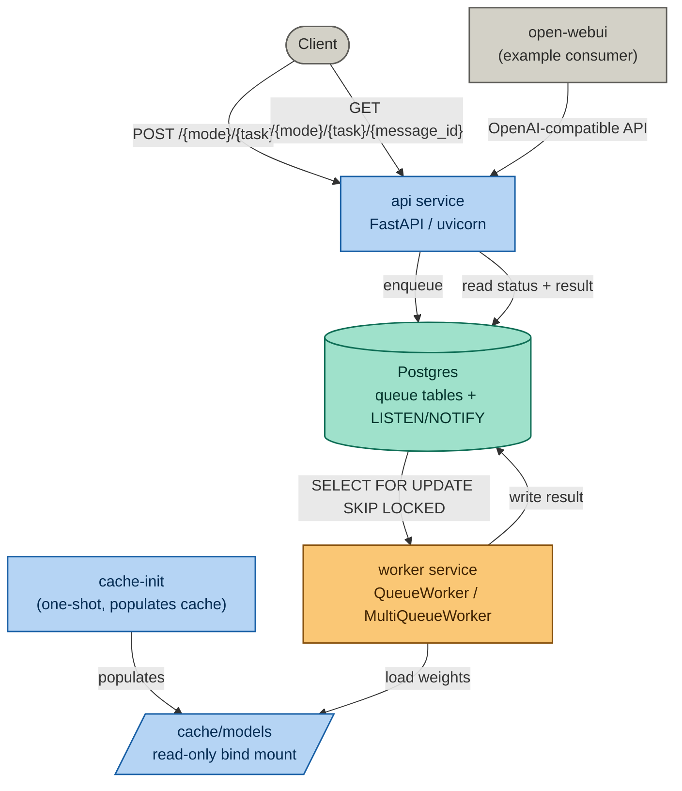
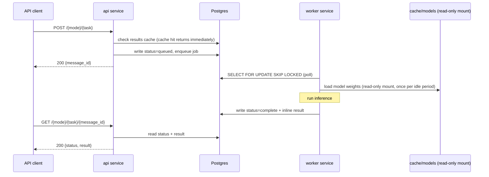

# Marigold

A typed inference protocol over neural network models. Typed operations --
a capability class, model, and input set -- produce immutable results drawn
from the model's output distribution. Operations compose into workflows:
declarative fact dependency graphs that the protocol fulfils without
application-level coordination.

Hosts HuggingFace models behind a typed inference API, running locally
via Docker Compose. Single operations and multi-step workflows are
first-class over the same handler registry and execution substrate.

The model set covers text and image embedding, instruction-following (chat),
text-to-speech, image generation, depth estimation, image segmentation, and
a suite of eval models for text and image quality scoring. All models run
from a shared model weight cache, loaded by a single environment
container image.

Marigold has no vector store of its own. RAG use cases currently rely on
a consumer's own vector store -- open-webui's internal store when using the
bundled example, or a separately-run store such as Qdrant, Chroma, or
Postgres/pgvector -- with Marigold supplying the embedding vectors via
`/embed/text` or `/v1/embeddings`.


## Architecture

Marigold runs as five Docker Compose services: `cache-init` (a one-shot
container that populates the model cache before anything else starts),
a Postgres database (queue tables, plus LISTEN/NOTIFY for pub/sub), a
worker service that polls its assigned queues and runs inference, an
API service (FastAPI via uvicorn), and open-webui as an example consumer
of the OpenAI-compatible endpoint.



### Inference flow



Text and vector outputs are written to and read from Postgres directly.
Binary outputs (images, audio, depth maps) are written to local disk
under `OUTPUT_DIR` when `OUTPUT_BACKEND=fs` -- see "Notes" below for
what is and is not yet retrievable through the API.

### Model cache

Model weights are stored on local disk and mounted read-only into the
worker container (`MARIGOLD_CACHE_DIR` in `.env`, `./cache/models` by
default). The cache is populated by the `cache-init` service on
`docker compose up`, reading whichever YAML file(s) `MODELS_CATALOGUE`
points at.

### Model catalogue files

Model weights can take a long time to download and use significant disk
space. Rather than one large `models.yaml` covering every model type,
catalogue files are kept small and task-specific:

- `assets/models-starter.yaml` -- one small instruct model, one small
  text-embedding model. The default `MODELS_CATALOGUE` value; the
  smallest useful footprint.
- `assets/models-tutorial-rag.yaml` -- starter pack plus the embedding
  model used in the local RAG tutorial.
- `assets/models-tutorial-image-rag.yaml` -- an image-embedding model
  for the image RAG tutorial.
- `assets/models-{purpose}-3060.yaml` -- larger, hardware-tier-specific
  presets for benchmarking and heavier local use.

`MODELS_CATALOGUE` accepts a comma-separated list, so a deployment
combining several of these (e.g. starter pack plus embeddings) is a
single environment variable change, not a new file.

### Model selection

The worker reads `MARIGOLD_MODELS`, a comma-separated list of model
hash IDs, to determine which models it serves. The hashes correspond to
entries generated from the active `MODELS_CATALOGUE`. There is currently
no documented step for going from a human-readable model name to its
hash for the purpose of writing this environment variable by hand.


## Model types

| Type | Input | Output | Example models |
|---|---|---|---|
| text-embedding | text | vector | all-minilm-l6-v2, bge-small-en-v1.5 |
| image-embedding | image | vector | clip-ViT-B-32 |
| instruct | chat | chat | qwen2-1.5b-instruct, qwen2.5-3b-instruct |
| tts | text | audio (mp3) | mms-tts-eng, mms-tts-cym |
| txt2img | text | image (png) | stable-diffusion-3.5-large-turbo, flux.1-schnell |
| img2txt | image | text | paligemma2 |
| depth | image | depth map (png) | dpt-dinov2-small-kitti |
| img2mask | image | segmentation mask (png) | sam-vit-huge |
| text-eval | text | scores | toxic-bert, distilbert-sst2 |
| text-similarity | text pair | similarity score | all-minilm-l6-v2 |
| image-eval | image | scores | nsfw-image-detection, cafe-aesthetic |
| image-text-eval | image + text | alignment score | clip-ViT-B-32 |

`image-embedding` has an implemented handler but no tested catalogue
entry as of writing; see `assets/models-tutorial-image-rag.yaml` once
created.


## OpenAI-compatible endpoints

`GET /v1/models`, `POST /v1/chat/completions`, `POST /v1/embeddings` are
implemented as a synchronous wrapper around Marigold's async submit/poll
path, for use with unmodified OpenAI-SDK clients (open-webui, LangChain,
LangGraph).

Two limitations worth knowing before relying on this for anything beyond
basic chat:

- `stream=true` is accepted and returns correctly-framed SSE chunks, but
  generation itself is still a single blocking call -- there is no
  token-level streaming.
- Only one tool call per assistant turn round-trips correctly. The wire
  format has no field for `tool_call_id`, so a turn with parallel tool
  calls cannot be matched back to the call that produced it.


## Repository structure

```
assets/
  models.yaml                    -- full model registry
  models-starter.yaml            -- minimal default catalogue
  models-tutorial-*.yaml         -- task-specific catalogues
  models-*-3060.yaml             -- hardware-tier presets

package/src/
  api/                           -- API definitions; routes/ is a package
  models/                        -- model handler code (one file per model type)
  shared/                        -- enums, registry, output persistence, usage tracking
  tools/
    cache_builder_shared.py      -- cache build/inspect logic
    model_cli.py                 -- model, cache, workflow, and status CLI
```


## Prerequisites

- Docker and Docker Compose
- NVIDIA Container Toolkit (for the GPU worker service)
- Python 3 with virtualenv (for local tooling)
- A HuggingFace token (required only for gated models such as
  meta-llama; set as `HF_TOKEN` for the cache build step)


## Deployment

```bash
# 1. Copy and adjust local configuration
cp .env.example .env

# 2. Start the stack -- cache-init populates the cache on first run
docker compose up
```

`MODELS_CATALOGUE` (default: `assets/models-starter.yaml`) determines
which models are downloaded and served. Override it for a larger
catalogue, e.g.:

```bash
MODELS_CATALOGUE=assets/models-starter.yaml,assets/models-tutorial-rag.yaml \
  docker compose up
```

To pick up changes after adding or removing models from the active
catalogue file, restart with `docker compose up --build`.


## Handler architecture

### Registry and decorator

Every model type is registered at import time using the `@model_spec`
decorator from `shared.registry`. The decorator populates the `_SPECS`
singleton dict, keyed by `ModelType.value`. A `ModelSpec` instance
couples: the `ModelType` enum value, the `ModelMode` (embed / eval /
gen), the loader function, the handler class implementing `_run()`, the
request and response Pydantic models, the binary `OutputField`
declarations, and the API route path.

### Loader contract

Every loader function must return a `ModelLoaderResult`:

```python
@dataclass
class ModelLoaderResult:
    processor: Any   # tokenizer, image processor, or None
    model: Any       # the model, pipeline, or SentenceTransformer
```

`standard_loader` in `models/standard_loader.py` handles the common
`AutoTokenizer` / `AutoProcessor` + `AutoModel` pattern. Model-type-specific
loaders select the correct transformer classes and delegate to it.

### Handler contract

`BaseModelHandler.process()` validates the request dict against
`ModelSpec.request_model` and calls `self._run()` with the typed result.
Subclasses implement only `_run()`.

### Adding a model

1. Add an entry to the relevant `assets/models-*.yaml` file.
2. If the type is new, create a handler file in `package/src/models/`
   following the existing pattern; if the type exists, the model is
   served by the existing handler.
3. Register the new handler import in `models/load_all()`.
4. Run `make models/validate`, then `make cache/local` to verify the
   model caches and loads correctly.
5. Restart: `docker compose up --build`.


## Authentication

No API key is required. Requests are accepted from any caller; the
caller is identified by an optional `X-User-Id` header, defaulting to
`local-user` (see `auth.py`, `get_authorizer()`).


## Notes

- Local model cache size varies by catalogue file; run `make cache/inspect`
  to see per-model sizes for whichever catalogue is active.
- The meta-llama model requires a HuggingFace token with access granted
  at huggingface.co/meta-llama. Without a token it is skipped during
  caching.
- Binary output persistence to local disk (images, audio, depth maps) is
  implemented on write: `write_binary_output()` writes to `OUTPUT_DIR`
  when `OUTPUT_BACKEND=fs`. Retrieval through the API is not yet
  implemented -- `GET /output/{mode}/{task}/{message_id}/{field}`
  currently returns 501 regardless of backend. The file is on disk;
  fetching it back over HTTP is not yet wired up.
- `img2mesh` (3D mesh reconstruction from images) is declared as a stub
  and not yet implemented.
