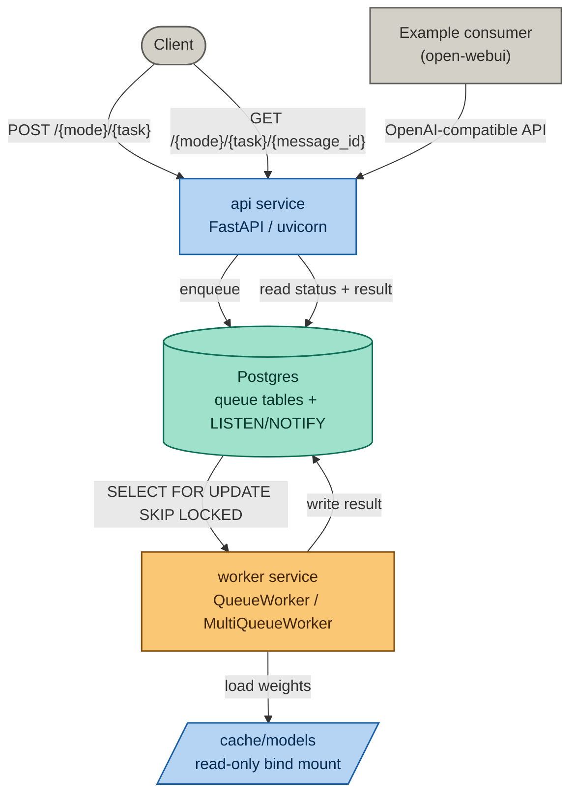
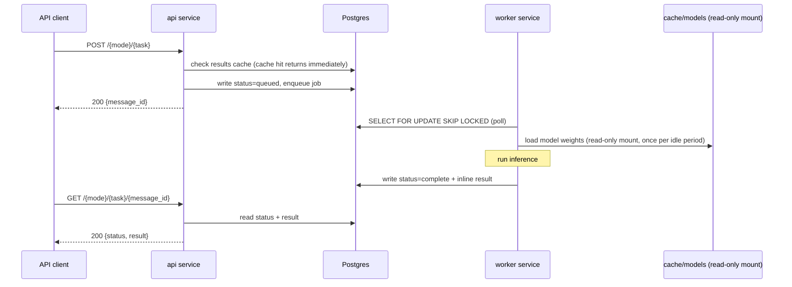

# Marigold

A typed inference protocol over neural network models. Typed operations --
a capability class, model, and input set -- produce immutable results drawn
from the model's output distribution. Operations compose into workflows:
declarative fact dependency graphs that the protocol fulfils without
application-level coordination.

Hosts HuggingFace models behind a typed inference API, running locally
via Docker Compose. Single operations and multi-step workflows are
first-class over the same handler registry and execution substrate.

The model set covers text and image embedding, instruction-following (chat),
text-to-speech, image generation, depth estimation, image segmentation, and
a suite of eval models for text and image quality scoring. All models run
from a shared model weight cache, loaded by a single environment
container image.


## Architecture

Marigold runs as three Docker Compose services: a Postgres database
(queue tables, plus LISTEN/NOTIFY for pub/sub), a worker service that
polls its assigned queues and runs inference, and an API service
(FastAPI via uvicorn) that accepts requests and returns job status. A
read-only bind mount provides the worker with pre-built model weights.



### Inference flow



Text and vector outputs are written to and read from Postgres directly.
Binary outputs (images, audio, depth maps) do not yet have a local
persistence path -- see "Notes" below.

### Model cache

Model weights are stored on local disk and mounted read-only into the
worker container (`MARIGOLD_CACHE_DIR` in `.env`, `./cache/models` by
default). The cache is populated ahead of time by running
`make cache/local`, which reads `assets/models.yaml` (or a model subset
such as `assets/models-3060.yaml` for a single consumer GPU) as its
source of truth and prunes any weights no longer declared. The compose
file does not build the cache itself; it expects the mount to already
be populated.

### Model selection

The worker reads `MARIGOLD_MODELS`, a comma-separated list of model
hash IDs, to determine which models it serves. The hashes correspond to
entries in `assets/models.json` (generated by `make models/generate`
from `models.yaml`). There is currently no documented step for going
from a human-readable model name to its hash for the purpose of writing
this environment variable by hand.


## Model types

| Type | Input | Output | Example models |
|---|---|---|---|
| text-embedding | text | vector | paraphrase-multilingual-mpnet-base-v2, all-minilm-l6-v2 |
| image-embedding | image | vector | clip-ViT-B-32 |
| instruct | chat | chat | qwen2-0.5b, qwen2-1.5b, phi-3-mini, llama-3.2-1b |
| tts | text | audio (mp3) | mms-tts-eng, mms-tts-cym, mms-tts-deu, mms-tts-fra |
| txt2img | text | image (png) | stable-diffusion-v1-5 |
| img2txt | image | text | llava, paligemma |
| depth | image | depth map (png) | dpt-dinov2-small-kitti |
| img2mask | image | segmentation mask (png) | sam-vit-huge |
| text-eval | text | scores | toxic-bert, distilbert-sst2 |
| text-similarity | text pair | similarity score | all-minilm-l6-v2 |
| image-eval | image | scores | nsfw-image-detection, cafe-aesthetic |
| image-text-eval | image + text | alignment score | clip-ViT-B-32 |


## Repository structure

```
assets/
  models.yaml                   -- model registry (single source of truth)
  models.json                   -- generated by models/generate; bind-mounted
                                    into worker/api
  public_models_reference.json  -- generated by models/catalogue, served at /models.json

package/src/
  api/                          -- API definitions; routes/ is a package, not a single file
  models/                       -- model handler code (one file per model type)
  shared/                       -- enums, registry, output persistence, usage tracking
  tools/
    cache_builder_shared.py     -- cache build/inspect logic
    cache_builder_local.py      -- local cache builder entry point (reads YAML)
```


## Prerequisites

- Docker and Docker Compose
- NVIDIA Container Toolkit (for the GPU worker service)
- Python 3 with virtualenv (for `make cache/local` and other tooling)
- A HuggingFace token (required only for gated models such as
  meta-llama; set as `HF_TOKEN` for the cache build step)


## Deployment

```bash
# 1. Copy and adjust local configuration (cache locations, ports,
#    Postgres credentials -- see .env.example for the full list)
cp .env.example .env

# 2. Generate the model registry files from models.yaml
make models/generate

# 3. Populate the local model cache (reads assets/models.yaml, or a
#    subset file such as assets/models-3060.yaml for a single
#    consumer GPU)
make cache/local

# 4. Start the stack
docker compose -f docker-compose.local.yaml up
```

The worker service selects which cached models to serve via the
`MARIGOLD_MODELS` environment variable -- see "Model selection" above.
The cache directory is mounted read-only; it must already be populated
before the worker starts.

To pick up changes after adding or removing models from
`assets/models.yaml`:

```bash
make models/generate
make cache/local
docker compose -f docker-compose.local.yaml up --build
```


## Model cache

Populate the local cache (required before starting docker compose; see
Deployment above):

```bash
make cache/local
```

Inspect cache contents and check for drift against `models.yaml`:

```bash
make cache/inspect
```

To cache a subset of models, pass an override file such as
`assets/models-3060.yaml` (consumer-GPU presets) or your own
`assets/models-dev.yaml`:

```bash
make MODELS_YAML=assets/models-3060.yaml cache/local
```


## Handler architecture

### Registry and decorator

Every model type is registered at import time using the `@model_spec` decorator
from `shared.registry`. The decorator populates the `_SPECS` singleton dict,
keyed by `ModelType.value`. A `ModelSpec` instance couples:

- the `ModelType` enum value
- the `ModelMode` (embed / eval / gen), which determines the URL prefix
- the loader function, called once at task start to load weights from the
  model cache
- the handler class, which implements `_run()`
- the request and response Pydantic models
- the list of binary `OutputField` declarations
- the API route path

`_SPECS` is populated by calling `models.load_all()`, which imports every
handler module. This must be called before any code that looks up a spec by
model type. Importing `models` alone does not trigger handler imports.

### Loader contract

Every loader function must return a `ModelLoaderResult` instance:

```python
@dataclass
class ModelLoaderResult:
    processor: Any   # tokenizer, image processor, or None
    model: Any       # the model, pipeline, or SentenceTransformer
```

`BaseModelHandler.__init__` calls `spec.loader(modelname, cache_dir)` and
unpacks the result into `self.processor` and `self.model`. Loaders that
produce a single object (e.g. a diffusers pipeline) set `processor=None`.
Loaders using sentence-transformers, which handle tokenisation internally,
also set `processor=None`.

`standard_loader` in `models/standard_loader.py` handles the common
`AutoTokenizer` / `AutoProcessor` + `AutoModel` pattern and returns a
`ModelLoaderResult`. Model-type-specific loaders select the correct
transformer classes and delegate to `standard_loader`.

### Handler contract

`BaseModelHandler.process()` validates the raw request dict against
`ModelSpec.request_model` and calls `self._run()` with the typed result.
Subclasses implement only `_run()`:

```python
def _run(self, user_id: str, message_id: str, request: SpecificRequest) -> SpecificResponse:
    ...
```

`process()` is not overridden by subclasses. `QueueWorker` (or
`MultiQueueWorker` for a worker serving several models) calls
`model.process(user_id, message_id, request_dict)` and expects a
Pydantic `BaseModel` instance in return.

### Adding a model

1. Add an entry to `assets/models.yaml` with the HuggingFace model name, type,
   input/output modalities, and memory/timeout settings.
2. If the type is new, create a handler file in `package/src/models/` following
   the pattern below. If the type already exists, the new model will be served
   by the existing handler.
3. Register the new handler import in `models/load_all()` in
   `package/src/models/__init__.py`.
4. Run `make models/validate` to check the `models.yaml` schema.
5. Run `make models/generate` to regenerate `assets/models.json`.
6. Run `make cache/local` to verify the model caches and loads correctly.
7. Restart the worker and api services:
   `docker compose -f docker-compose.local.yaml up --build`.

### Handler file template

```python
from shared.enums import ModelMode, ModelType
from shared.registry import BaseModelHandler, model_spec
from models.standard_loader import standard_loader, ModelLoaderResult
from api.models import MyRequest, MyResponse


def load_my_type(modelname: str, cache_dir: str = None, **kwargs) -> ModelLoaderResult:
    from transformers import AutoTokenizer as T
    from transformers import AutoModelForSomeTask as M
    return standard_loader(T, M, modelname, cache_dir=cache_dir, **kwargs)


@model_spec(
    model_type=ModelType.MY_TYPE,
    mode=ModelMode.GEN,
    output_fields=[],
    loader=load_my_type,
    request_model=MyRequest,
    response_model=MyResponse,
    route="/gen/my-type",
)
class MyTypeModel(BaseModelHandler):

    def _run(self, user_id: str, message_id: str, request: MyRequest) -> MyResponse:
        # inference here
        ...
```

### API routes

`package/src/api/routes/` is a package (catalogue, embed, eval, gen,
openai, output, usage, users, and the submission handler), not a
single templated file. `api.main` imports it directly as a working
FastAPI router; this is what the `api` service runs via
`uvicorn api.main:app`.


## Authentication

No API key is required. Requests are accepted from any caller; the
caller is identified by an optional `X-User-Id` header, defaulting to
`local-user` (see `auth.py`, `get_authorizer()`).


## Notes

- Local model cache size is approximately 32 GB for the default model
  set. Run `make cache/inspect` to see per-model sizes.
- The meta-llama model requires a HuggingFace token with access granted
  at huggingface.co/meta-llama. Without a token it is skipped during
  caching.
- Binary output persistence (images, audio, depth maps) to local disk
  is not yet implemented. Inference results themselves are unaffected;
  binary outputs do not currently persist.
- `img2mesh` (3D mesh reconstruction from images) is declared as a stub
  and not yet implemented. The depth handler produces the depth map
  that would serve as its primary input.
