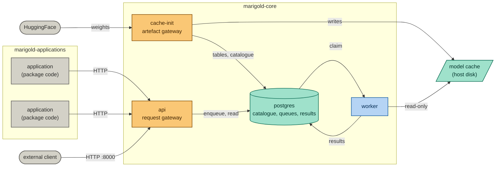
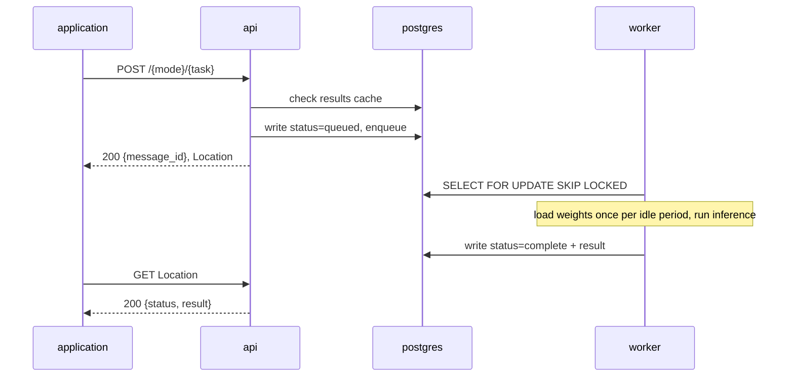

# Marigold

[](https://pypi.org/project/bayis-marigold/)
[](https://github.com/bayinfosys/marigold/tags)

A typed inference protocol over neural network models, self-hosted.
Typed operations -- a capability class, a model and an input set --
produce immutable results that applications compose.

Marigold runs as three separate layers on one host:

- **the platform** -- a model cache, a catalogue, a worker and an API,
  shared by everything on the host;
- **packages** -- a list of required models plus application code,
  installed into the cache by name;
- **applications** -- a package's code running in its own container,
  reaching the platform only through the API.

Applications hold no weights. Many applications share one model cache
and one worker, which is what lets a fleet of agents run on a single
local GPU and the same package run unchanged on larger hardware.

For a walkthrough, see the [setup tutorial](https://marigold.run/tutorials/setup.html).
The design is described in [ARCHITECTURE.md](docs/ARCHITECTURE.md),
[PACKAGES.md](docs/PACKAGES.md) and [PRINCIPLES.md](docs/PRINCIPLES.md).

## Status

Early stage. Interfaces, config format and the CLI may change without
notice. Issues and questions are welcome; for a pull request, open an
issue first to discuss the change before writing code.

## Prerequisites

- Docker and Docker Compose
- NVIDIA Container Toolkit, for a GPU worker
- Python 3.12, for the `marigold` command
- A HuggingFace token, for gated models

## Getting started

```bash
pip install bayis-marigold
git clone https://github.com/bayinfosys/marigold-examples

marigold cache init
marigold package create marigold-examples/platform-model-test -o /tmp
marigold package install /tmp/platform-model-test-0.2.0.tar.gz
marigold cache populate platform-model-test
marigold application start platform-model-test
marigold application logs platform-model-test
```

`cache init` creates the cache layout. `package install` puts the
package in the cache under its name. `cache populate` downloads the
models it declares and registers them in the catalogue. `application
start` brings the platform up if it is not already running, then starts
the package's application in its own container.

```bash
marigold platform status               # platform and every application
marigold platform logs [service]       # api, worker, postgres, cache-init
marigold application stop <package>    # the application only
marigold platform stop --applications  # everything
marigold package list                  # installed packages
marigold cache inspect                 # what is cached, sizes, location
marigold config show [package]         # resolved configuration and its sources
```

## Configuration

Two layers of TOML. The system config holds host settings; each
package's `marigold.toml` declares what the package is and runs.
Package values win per key.

The system config is `$MARIGOLD_CONFIG` if set, otherwise `config.toml`
in the current directory, otherwise `~/.marigold/config.toml`. Because
of the second rule, changing directory can change which config is used;
set `MARIGOLD_CONFIG` in scripts.

```toml
# config.toml -- the host
[platform]
compose_files = ["core", "cpu"]    # or ["core", "cpu", "gpu"]
# tag = "0.7.0"                    # default: the installed CLI's version

[cache]
dir = "/data/marigold"             # default: ~/.marigold/cache

[database]
url = "postgresql://..."           # default: the platform's own Postgres
```

```toml
# marigold.toml -- a package
[package]
name = "chat"
version = "0.1.0"
models_yaml = ["models.yaml"]
compose_files = ["webui"]          # additions to the platform

[execution]
command = ["python", "main.py"]

[environment]
RAG_EMBEDDING_MODEL = "sentence-transformers/all-minilm-l6-v2"
```

`[environment]` forwards variables to the containers without the CLI
interpreting them. `marigold config show <package>` prints every
resolved value and the layer it came from.

The full package format is in [PACKAGES.md](docs/PACKAGES.md).

## The model cache

```bash
marigold cache populate <package>    # download and register a package's models
marigold cache validate <package>    # check its models.yaml, no download
marigold cache inspect               # list what is on disk
```

The cache outlives every package. A model downloaded for one is
available to all; uninstalling a package removes nothing from the cache
or the catalogue. `populate --prune` removes cached models the given
package does not declare, and refuses when it declares none.

Model catalogue files are kept small and task-specific. A package lists
as many as it needs:

```toml
[package]
models_yaml = ["models-instruct.yaml", "models-embed.yaml"]
```

## Architecture



Two components face outward: the cache container brings artefacts in,
and the API lets requests in. The worker makes no outbound calls.
Postgres publishes no port on the host. Networks, mounts and the access
model are in [ARCHITECTURE.md](docs/ARCHITECTURE.md).

### Inference flow



Text and vector outputs are stored in Postgres. Binary outputs are
written under the cache's `data/outputs`.

## Model types

| Type | Input | Output | Example models |
|---|---|---|---|
| text-embedding | text | vector | all-minilm-l6-v2, bge-small-en-v1.5 |
| image-embedding | image | vector | clip-vit-base-patch32 |
| instruct | chat | chat | qwen3-0.6b, qwen2.5-3b-instruct |
| tts | text | audio (mp3) | mms-tts-eng, mms-tts-cym |
| txt2img | text | image (png) | stable-diffusion-3.5-large-turbo, flux.1-schnell |
| img2txt | image | text | smolvlm-256m-instruct, paligemma2 |
| depth | image | depth map (png) | dpt-dinov2-small-kitti |
| img2mask | image | segmentation mask (png) | sam-vit-huge |
| text-eval | text | scores | toxic-bert, distilbert-sst2 |
| text-similarity | text pair | similarity score | all-minilm-l6-v2 |
| image-eval | image | scores | nsfw-image-detection, cafe-aesthetic |
| image-text-eval | image + text | alignment score | clip-vit-base-patch32 |

## OpenAI-compatible endpoints

`GET /v1/models`, `POST /v1/chat/completions` and `POST /v1/embeddings`
wrap Marigold's submit and poll path for unmodified OpenAI-SDK clients
(open-webui, LangChain, LangGraph, Continue.dev and others).

- `stream=true` returns correctly framed SSE chunks, without
  token-level streaming.
- One tool call per assistant turn round-trips correctly. The wire
  format has no field for `tool_call_id`, so parallel tool calls cannot
  be matched back to the call that produced them.

## Repository structure

```
package/src/
  api/                  FastAPI application; routes/ is a package
  models/               model handlers, one file per model type
  shared/               enums, registry, database, outputs, usage
  cli/                  the `marigold` command
    main.py             parser
    commands.py         command implementations
    config.py           system and package TOML, with provenance
    paths.py            the cache layout
    packages.py         package identity, archives, installation
    compose.py          compose projects, environment, invocation
  compose/              compose files and the multi-stage Dockerfile
  tools/
    cache_cli.py        the cache container's entrypoint
    model_cache_shared.py  cache providers
```

Application packages live in [marigold-examples](https://github.com/bayinfosys/marigold-examples).

## Handler architecture

### Registry and decorator

Every model type is registered at import time with the `@model_spec`
decorator from `shared.registry`, which populates `_SPECS`, keyed by
`ModelType.value`. A `ModelSpec` couples the model type, the mode
(embed, eval, gen), the loader, the handler class implementing
`_run()`, the request and response models, the binary output fields,
and the API route.

### Loader contract

Every loader returns a `ModelLoaderResult`:

```python
@dataclass
class ModelLoaderResult:
    processor: Any   # tokenizer, image processor, or None
    model: Any       # the model, pipeline, or SentenceTransformer
```

`standard_loader` in `models/standard_loader.py` handles the common
`AutoTokenizer` / `AutoProcessor` plus `AutoModel` pattern.

### Handler contract

`BaseModelHandler.process()` validates the request against
`ModelSpec.request_model` and calls `_run()` with the typed result.
Subclasses implement only `_run()`.

### Adding a model

1. Add an entry to a package's `models.yaml`.
2. If the type is new, add a handler in `package/src/models/` following
   the existing pattern and register its import in `models/load_all()`.
3. `marigold cache validate <package>` to check the file.
4. Reinstall the package and `marigold cache populate <package>`.

## Authentication

No API key is required. The caller is identified by an optional
`X-User-Id` header, defaulting to `local-user`.

This is designed for localhost or a private network. Marigold provides
no authentication of its own today; if you expose the API beyond that
boundary, put your own authentication in front of it. The API is the
single point where that will be added.
