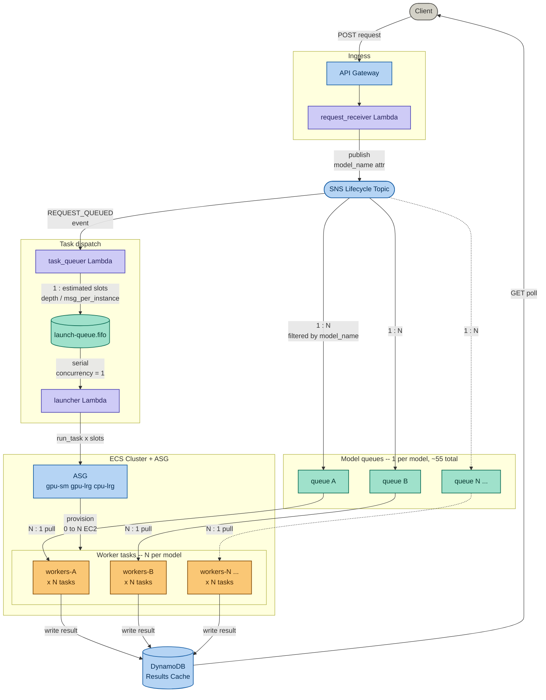
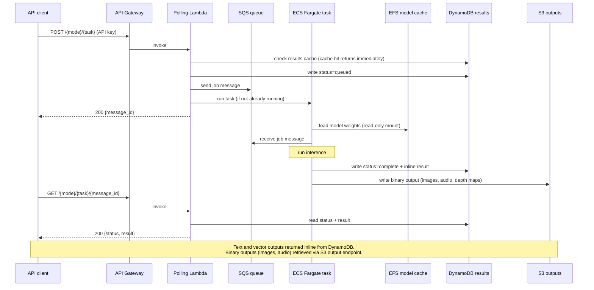

# Marigold

A typed inference protocol over neural network models. Typed operations --
a capability class, model, and input set -- produce immutable results drawn
from the model's output distribution. Operations compose into workflows:
declarative fact dependency graphs that the protocol fulfils without
application-level coordination.

Hosts HuggingFace models on AWS. Single operations and multi-step workflows
are first-class over the same handler registry and execution substrate.

The model set covers text and image embedding, instruction-following (chat),
text-to-speech, image generation, depth estimation, image segmentation, and
a suite of eval models for text and image quality scoring. All models run
from a shared model weight cache on EFS, loaded by a single environment
container image.


## Architecture

# line 138 -- wrong
enqueue_launch(dispatch, model_name, model_hash, message_id, estimated)

# correct
enqueue_launch(model_name, model_hash, message_id, estimated)
```

One character fix. The `dispatch` object was removed from `enqueue_launch`'s parameters when the slot loop was added but the call site was not updated.

**launcher:** Working perfectly. Sequential launches, ~300-600ms per task, `active_before=0` throughout. The serialisation is doing its job.

---

Mermaid diagram as markdown:

```


Three Terraform layers build on each other:
```
tf/01  -- VPC, EFS (model cache), ECR (container registry)
tf/02  -- ECS cluster, SQS queues, S3 buckets, DynamoDB tables, polling lambda
tf/03  -- API Gateway, custom domain, TLS certificates, API key management
```

A separate tool layer manages the EFS model cache:

```
tf/cache-builder  -- EC2 instance that populates EFS from HuggingFace, then self-terminates
```

### Inference flow



Large binary outputs (audio, images, depth maps) are written to S3 and
retrieved via a dedicated output endpoint. Text and vector outputs are
returned inline from DynamoDB.

### Model cache

Model weights are stored on EFS and mounted read-only into every ECS task.
The cache is populated by running `make cache/local` (local) or by deploying
`tf/cache-builder` (AWS). The cache manager reads `assets/models.yaml` as its
source of truth and prunes any weights no longer declared.

### ECS capacity

The cluster runs on FARGATE and FARGATE_SPOT by default. A GPU capacity
provider backed by an EC2 auto-scaling group (g4dn family) is defined at zero
capacity and can be activated by routing specific task definitions to it.


## Model types

| Type | Input | Output | Example models |
|---|---|---|---|
| text-embedding | text | vector | paraphrase-multilingual-mpnet-base-v2, all-minilm-l6-v2 |
| image-embedding | image | vector | clip-ViT-B-32 |
| instruct | chat | chat | qwen2-0.5b, qwen2-1.5b, phi-3-mini, llama-3.2-1b |
| tts | text | audio (mp3) | mms-tts-eng, mms-tts-cym, mms-tts-deu, mms-tts-fra |
| txt2img | text | image (png) | stable-diffusion-v1-5 |
| img2txt | image | text | llava, paligemma |
| depth | image | depth map (png) | dpt-dinov2-small-kitti |
| img2mask | image | segmentation mask (png) | sam-vit-huge |
| text-eval | text | scores | toxic-bert, distilbert-sst2 |
| text-similarity | text pair | similarity score | all-minilm-l6-v2 |
| image-eval | image | scores | nsfw-image-detection, cafe-aesthetic |
| image-text-eval | image + text | alignment score | clip-ViT-B-32 |


## Repository structure

```
assets/
  models.yaml                   -- model registry (single source of truth)
  models.tfvars                 -- generated by models/generate (not committed)
  models.json                   -- generated by models/generate, uploaded to S3
  public_models_reference.json  -- generated by models/catalogue, served at /models.json

package/src/
  api/                          -- API route and request/response model definitions
  models/                       -- model handler code (one file per model type)
  shared/                       -- enums, registry, output persistence, usage tracking
  tools/
    cache_builder_shared.py     -- cache build/inspect logic (no AWS dependency)
    cache_builder_local.py      -- local cache builder entry point (reads YAML)
    cache_builder_aws.py        -- AWS cache builder entry point (reads S3, self-terminates)
    generate_tfvars.py          -- generates models.tfvars, models.json, public catalogue

tf/
  01/                           -- infrastructure layer (VPC, EFS, ECR)
  02/                           -- application layer (ECS, queues, tables)
  03/                           -- API layer (gateway, domain, auth)
  cache-builder/                -- EFS population tool (EC2, self-terminates on completion)
  common.tfvars                 -- shared variables (domain, org)
```


## Prerequisites

- AWS CLI configured with appropriate credentials
- Terraform >= 1.5
- Docker
- Python 3 with virtualenv
- HuggingFace token in AWS SSM at the path configured in `tf/cache-builder/variables.tf`
  (required only for gated models such as meta-llama)


## Deployment

Deploy layers in order. Each layer reads outputs from the previous via S3
remote state.

```bash
# 1. Build and push the environment container
make build/environment
make push/environment

# 2. Infrastructure layer
make LAYER=01 init plan apply

# 3. Generate model tfvars from models.yaml
make models/generate

# 4. Application layer
make LAYER=02 init plan apply

# 5. API layer
make LAYER=03 init plan apply

# 6. Populate the model cache on EFS
make deploy/cache-builder
```

To redeploy after adding or removing models from `assets/models.yaml`:

```bash
make models/generate
make LAYER=02 apply
make LAYER=03 apply
make deploy/cache-builder
```


## Model cache

Build the local cache (useful for testing model handlers without deploying
to AWS):

```bash
make cache/local
```

Inspect cache contents and check for drift against `models.yaml`:

```bash
make cache/inspect
```

To cache a subset of models during development, create `assets/models-dev.yaml`
and pass it as an override:

```bash
make MODELS_YAML=assets/models-dev.yaml cache/local
```


## Handler architecture

### Registry and decorator

Every model type is registered at import time using the `@model_spec` decorator
from `shared.registry`. The decorator populates the `_SPECS` singleton dict,
keyed by `ModelType.value`. A `ModelSpec` instance couples:

- the `ModelType` enum value
- the `ModelMode` (embed / eval / gen), which determines the URL prefix
- the loader function, called once at task start to load weights from EFS
- the handler class, which implements `_run()`
- the request and response Pydantic models
- the list of binary `OutputField` declarations
- the API route path

`_SPECS` is populated by calling `models.load_all()`, which imports every
handler module. This must be called before any code that looks up a spec by
model type. Importing `models` alone does not trigger handler imports.

### Loader contract

Every loader function must return a `ModelLoaderResult` instance:

```python
@dataclass
class ModelLoaderResult:
    processor: Any   # tokenizer, image processor, or None
    model: Any       # the model, pipeline, or SentenceTransformer
```

`BaseModelHandler.__init__` calls `spec.loader(modelname, cache_dir)` and
unpacks the result into `self.processor` and `self.model`. Loaders that
produce a single object (e.g. a diffusers pipeline) set `processor=None`.
Loaders using sentence-transformers, which handle tokenisation internally,
also set `processor=None`.

`standard_loader` in `models/standard_loader.py` handles the common
`AutoTokenizer` / `AutoProcessor` + `AutoModel` pattern and returns a
`ModelLoaderResult`. Model-type-specific loaders select the correct
transformer classes and delegate to `standard_loader`.

### Handler contract

`BaseModelHandler.process()` validates the raw request dict against
`ModelSpec.request_model` and calls `self._run()` with the typed result.
Subclasses implement only `_run()`:

```python
def _run(self, user_id: str, message_id: str, request: SpecificRequest) -> SpecificResponse:
    ...
```

`process()` is not overridden by subclasses. The `SQSWorker` calls
`model.process(user_id, message_id, request_dict)` and expects a Pydantic
`BaseModel` instance in return.

### Adding a model

1. Add an entry to `assets/models.yaml` with the HuggingFace model name, type,
   input/output modalities, and memory/timeout settings.
2. If the type is new, create a handler file in `package/src/models/` following
   the pattern below. If the type already exists, the new model will be served
   by the existing handler.
3. Register the new handler import in `models/load_all()` in
   `package/src/models/__init__.py`.
4. Run `make models/validate` to check the `models.yaml` schema.
5. Run `make models/generate` to regenerate `assets/models.tfvars` and
   `assets/models.json`.
6. Run `make cache/local` to verify the model caches and loads correctly.
7. Redeploy layers 02 and 03, then run `make deploy/cache-builder`.

### Handler file template

```python
from shared.enums import ModelMode, ModelType
from shared.registry import BaseModelHandler, model_spec
from models.standard_loader import standard_loader, ModelLoaderResult
from api.models import MyRequest, MyResponse


def load_my_type(modelname: str, cache_dir: str = None, **kwargs) -> ModelLoaderResult:
    from transformers import AutoTokenizer as T
    from transformers import AutoModelForSomeTask as M
    return standard_loader(T, M, modelname, cache_dir=cache_dir, **kwargs)


@model_spec(
    model_type=ModelType.MY_TYPE,
    mode=ModelMode.GEN,
    output_fields=[],
    loader=load_my_type,
    request_model=MyRequest,
    response_model=MyResponse,
    route="/gen/my-type",
)
class MyTypeModel(BaseModelHandler):

    def _run(self, user_id: str, message_id: str, request: MyRequest) -> MyResponse:
        # inference here
        ...
```

### routes.py and Terraform interpolation

`package/src/api/routes.py` is a template file. The `${...}` placeholders
are Terraform variable references interpolated during `make LAYER=03 apply`.
The file is not valid Python until after interpolation. Do not attempt to
import or execute it directly from the source tree.


## API keys

A master API key is created by Terraform and retrievable with:

```bash
terraform -chdir=tf/03 output -raw master_api_key_value
```

Additional keys are managed via the `/users/keys` endpoint.


## Notes

- EFS model cache size is approximately 32 GB for the default model set.
  Run `make cache/inspect` to see per-model sizes.
- The meta-llama model requires a HuggingFace token with access granted at
  huggingface.co/meta-llama. Without a token it is skipped during caching.
- The GPU capacity provider starts at zero. Activating it requires updating
  the desired capacity on the ASG and adding capacity provider strategy blocks
  to the relevant task definitions in `tf/02/ecs-tasks.tf`.
- Fargate tasks run on CPU. For large instruct models, inference is slower than
  GPU-based runtimes. The architecture supports adding GPU capacity without
  changes to the API or model handler code.
- `img2mesh` (3D mesh reconstruction from images) is declared as a stub and
  not yet implemented. The depth handler produces the depth map that would
  serve as its primary input.
