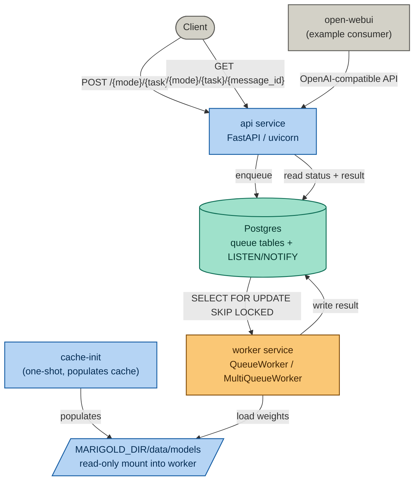
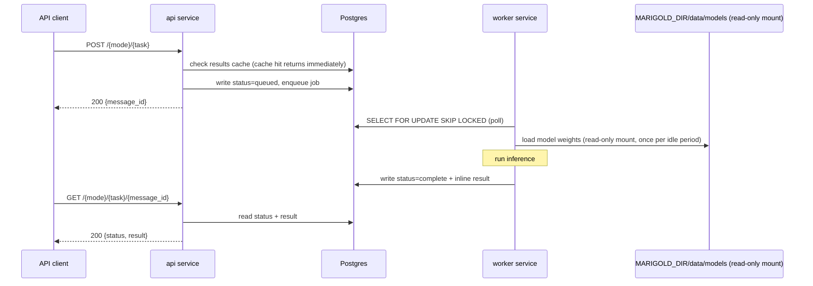

# Marigold

A typed inference protocol over neural network models. Typed operations --
a capability class, model, and input set -- produce immutable results drawn
from the model's output distribution. Operations compose into workflows:
declarative fact dependency graphs that the protocol fulfils without
application-level coordination.

Hosts HuggingFace models behind a typed inference API, running locally
via Docker Compose. Single operations and multi-step workflows are
first-class over the same handler registry and execution substrate.

The model set covers text and image embedding, instruction-following (chat),
text-to-speech, image generation, depth estimation, image segmentation, and
a suite of eval models for text and image quality scoring. All models run
from a shared model weight cache, loaded by a single environment
container image.

Marigold has no vector store of its own. RAG use cases currently rely on
a consumer's own vector store -- open-webui's internal store when using the
bundled example, or a separately-run store such as Qdrant, Chroma, or
Postgres/pgvector -- with Marigold supplying the embedding vectors via
`/embed/text` or `/v1/embeddings`.

For a full walkthrough with a worked example, see the
[setup tutorial](https://marigold.run/examples/setup/). What follows here
is the reference version.

## Architecture

Marigold's Docker Compose setup is split across three files:

- `docker-compose.core.yaml` -- the actual services: Postgres (queue
  tables, plus LISTEN/NOTIFY for pub/sub), `cache-init` (a one-shot
  container that populates the model cache before anything else starts),
  a worker service that polls its assigned queues and runs inference, and
  the API service (FastAPI via uvicorn).
- `docker-compose.webui.yaml` -- open-webui, as an example consumer of
  the OpenAI-compatible endpoint.
- `docker-compose.yaml` -- includes both of the above. This is the file
  Compose picks up by default, so `docker compose up` on its own gives
  you the full stack, open-webui included.



### Inference flow



Text and vector outputs are written to and read from Postgres directly.
Binary outputs (images, audio, depth maps) are written to local disk
under `MARIGOLD_DIR/data/outputs` -- see "Notes" below for what is and
is not yet retrievable through the API.

## `MARIGOLD_DIR`: one directory, nowhere else

Every piece of state a Marigold setup has -- which models to load, local
configuration, and everything the running containers produce -- lives
under one directory, pointed at by the `MARIGOLD_DIR` environment
variable. Nothing is stored anywhere else: no Docker named volumes, no
database outside this directory, no state held only inside a container.

### What you provide

```
your-setup/
  models.yaml     -- which models to load
  local.env       -- environment overrides for this setup
```

### What gets created

```
your-setup/
  data/
    models/       -- downloaded model weights
    tmp/          -- offload storage used during inference
    outputs/      -- binary outputs (images, audio, etc.)
    webui/        -- open-webui's own state (chat history, uploads,
                     its internal vector store for document retrieval)
```

`data/` doesn't need to exist beforehand -- Docker creates it as empty
directories the first time you run `docker compose up` against a new
`MARIGOLD_DIR`. Because `data/` is the entire state of the project,
`rm -rf your-setup/data` resets everything -- models, chat history,
uploaded documents -- and the next `docker compose up` rebuilds it from
nothing but `models.yaml` and `local.env`.

`MARIGOLD_DIR` must start with `./`, `../`, or `/`. A bare path with no
leading `./` is parsed by Compose as a named volume rather than a
directory on disk, giving you an empty, disconnected volume instead of
the directory you meant.

### `local.env`

```bash
# your-setup/local.env
# Used with: docker compose --env-file your-setup/local.env up

MARIGOLD_DIR=./your-setup
MODELS_CATALOGUE=/app/marigold/models.yaml

# Only needed if models.yaml includes a gated model.
HF_TOKEN=
```

`MODELS_CATALOGUE` is a path *inside the container*, always
`/app/marigold/...`, since that's where `MARIGOLD_DIR` gets mounted.

### Running air-gapped

Once `data/models` has been populated, every model your setup uses is on
local disk -- inference makes no external request. The compose files
set the environment variables needed to keep both Marigold's own
containers and open-webui from attempting any network call once models
are cached (`HF_HUB_OFFLINE` on the worker and api services, plus
open-webui's own offline/telemetry variables), so after the first
successful run the network connection can be removed entirely.

## Model catalogue files

Model weights can take a long time to download and use significant disk
space. Catalogue files are kept small and task-specific rather than one
large registry:

- `assets/models-{purpose}-3060.yaml` -- hardware-tier presets built
  into the repo (instruct, text-embedding, img2txt, txt2img), the
  default when `MARIGOLD_DIR` is unset.
- A `models.yaml` inside your own `MARIGOLD_DIR` -- self-contained,
  named, and reset independently of the built-in presets. This is the
  pattern each tutorial (`examples/simple-rag/`, and so on) uses.

`MODELS_CATALOGUE` accepts a comma-separated list, so combining a small
instruct model with an embedding model for RAG is one environment
variable, not a new file.

## Model types

| Type | Input | Output | Example models |
|---|---|---|---|
| text-embedding | text | vector | all-minilm-l6-v2, bge-small-en-v1.5 |
| image-embedding | image | vector | clip-ViT-B-32 |
| instruct | chat | chat | qwen2-1.5b-instruct, qwen2.5-3b-instruct |
| tts | text | audio (mp3) | mms-tts-eng, mms-tts-cym |
| txt2img | text | image (png) | stable-diffusion-3.5-large-turbo, flux.1-schnell |
| img2txt | image | text | paligemma2 |
| depth | image | depth map (png) | dpt-dinov2-small-kitti |
| img2mask | image | segmentation mask (png) | sam-vit-huge |
| text-eval | text | scores | toxic-bert, distilbert-sst2 |
| text-similarity | text pair | similarity score | all-minilm-l6-v2 |
| image-eval | image | scores | nsfw-image-detection, cafe-aesthetic |
| image-text-eval | image + text | alignment score | clip-ViT-B-32 |

`image-embedding` has an implemented handler but no tested catalogue
entry as of writing.

## OpenAI-compatible endpoints

`GET /v1/models`, `POST /v1/chat/completions`, `POST /v1/embeddings` are
implemented as a synchronous wrapper around Marigold's async submit/poll
path, for use with unmodified OpenAI-SDK clients (open-webui, LangChain,
LangGraph, Continue.dev, and others).

Two limitations worth knowing before relying on this for anything beyond
basic chat:

- `stream=true` is accepted and returns correctly-framed SSE chunks, but
  generation itself is still a single blocking call -- there is no
  token-level streaming.
- Only one tool call per assistant turn round-trips correctly. The wire
  format has no field for `tool_call_id`, so a turn with parallel tool
  calls cannot be matched back to the call that produced it.

## Repository structure

```
assets/
  models.yaml                    -- full model registry
  models-*-3060.yaml             -- hardware-tier presets

examples/
  simple-rag/                    -- worked MARIGOLD_DIR example: models.yaml,
                                     local.env, and everything it produces

package/src/
  api/                           -- API definitions; routes/ is a package
  models/                        -- model handler code (one file per model type)
  shared/                        -- enums, registry, output persistence, usage tracking
  tools/
    cache_builder_shared.py      -- cache build/inspect logic
    model_cli.py                 -- model, cache, workflow, and status CLI
```

## Prerequisites

- Docker and Docker Compose
- NVIDIA Container Toolkit (for the GPU worker service)
- Python 3 with virtualenv (for local tooling)
- A HuggingFace token, only if you plan to use a gated model such as
  anything under `meta-llama`

## Running it

```bash
git clone https://github.com/bayinfosys/marigold
cd marigold
docker compose --env-file your-setup/local.env up
```

The first run downloads the models listed in `models.yaml`; this is the
only point in the process requiring an internet connection. `cache-init`
completes before the worker and API start -- expected, they wait on it
deliberately.

Confirm it worked: `GET /v1/models` at `http://localhost:8000/docs`
should list your models; `http://localhost:3000` (open-webui) should
show an empty chat history on a genuinely fresh `MARIGOLD_DIR`.

## Handler architecture

### Registry and decorator

Every model type is registered at import time using the `@model_spec`
decorator from `shared.registry`. The decorator populates the `_SPECS`
singleton dict, keyed by `ModelType.value`. A `ModelSpec` instance
couples: the `ModelType` enum value, the `ModelMode` (embed / eval /
gen), the loader function, the handler class implementing `_run()`, the
request and response Pydantic models, the binary `OutputField`
declarations, and the API route path.

### Loader contract

Every loader function must return a `ModelLoaderResult`:

```python
@dataclass
class ModelLoaderResult:
    processor: Any   # tokenizer, image processor, or None
    model: Any       # the model, pipeline, or SentenceTransformer
```

`standard_loader` in `models/standard_loader.py` handles the common
`AutoTokenizer` / `AutoProcessor` + `AutoModel` pattern. Model-type-specific
loaders select the correct transformer classes and delegate to it.

### Handler contract

`BaseModelHandler.process()` validates the request dict against
`ModelSpec.request_model` and calls `self._run()` with the typed result.
Subclasses implement only `_run()`.

### Adding a model

1. Add an entry to the relevant `assets/models-*.yaml` file, or your own
   `MARIGOLD_DIR/models.yaml`.
2. If the type is new, create a handler file in `package/src/models/`
   following the existing pattern; if the type exists, the model is
   served by the existing handler.
3. Register the new handler import in `models/load_all()`.
4. Run `make models/validate`, then restart against the new catalogue
   to verify the model caches and loads correctly.

## Authentication

No API key is required. Requests are accepted from any caller; the
caller is identified by an optional `X-User-Id` header, defaulting to
`local-user` (see `auth.py`, `get_authorizer()`).

## Notes

- Binary output persistence to local disk (images, audio, depth maps) is
  implemented on write: `write_binary_output()` writes to
  `MARIGOLD_DIR/data/outputs` when `OUTPUT_BACKEND=fs`. Retrieval through
  the API is not yet implemented -- `GET /output/{mode}/{task}/{message_id}/{field}`
  currently returns 501 regardless of backend. The file is on disk;
  fetching it back over HTTP is not yet wired up.
- Marigold has no vector store of its own; see "Architecture" above.
- `img2mesh` (3D mesh reconstruction from images) is declared as a stub
  and not yet implemented.
