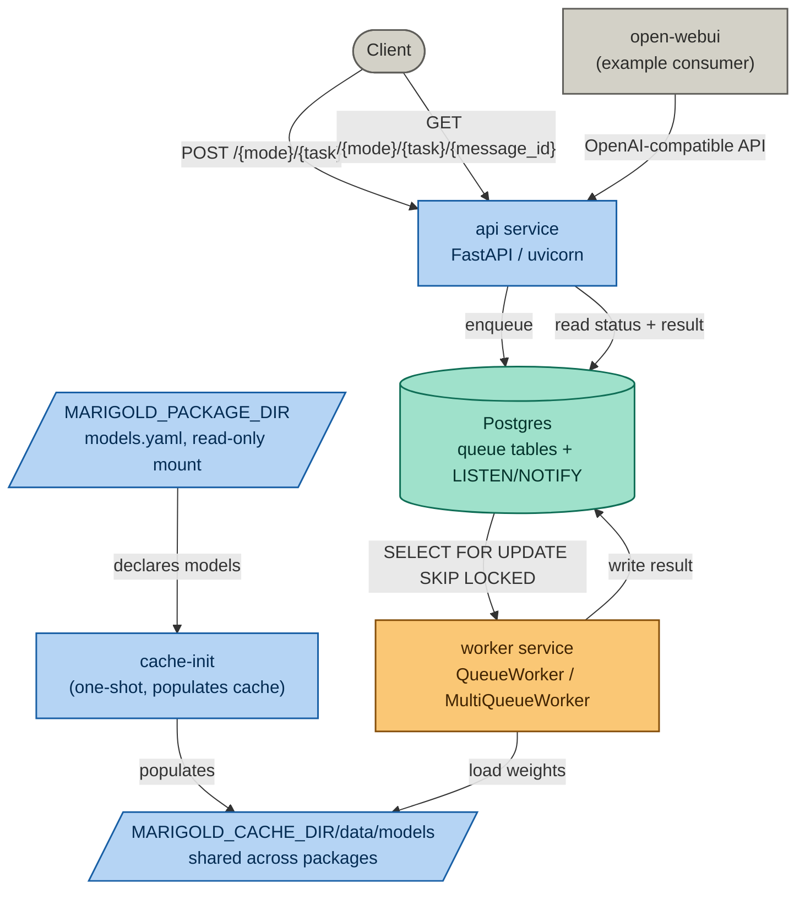
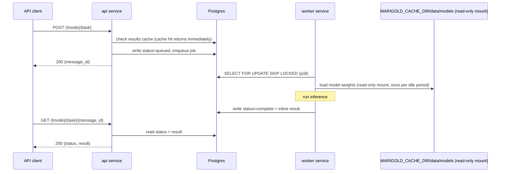

# Marigold

[](https://pypi.org/project/bayis-marigold/)
[](https://github.com/bayinfosys/marigold/tags)

A typed inference protocol over neural network models. Typed operations --
a capability class, model, and input set -- produce immutable results which can be chained together into workflows.

Applications are defined as simple python scripts over typed-model operations.
These applications are distributed with the model requirements.

Models are hosted and executed locally behind a typed inference API, orchestrated via Docker Compose.

The model set covers:
+ text and image embedding,
+ instruction-following (chat),
+ text-to-speech,
+ image generation,
+ depth estimation,
+ image segmentation, and
+ a suite of eval models for text and image quality scoring.
All models run from a shared model weight cache, independent of which application package is currently running.

For a full walkthrough with a worked example, see the
[setup tutorial](https://marigold.run/tutorials/setup.html). What follows
here is the reference version.

## Prerequisites

- Docker and Docker Compose
- NVIDIA Container Toolkit (for the GPU worker service)
- Python 3, for local development against this repo (not required just   to run it -- see Getting started)
- A HuggingFace token, if you plan to use a gated model.

## Getting started

```bash
pip install bayis-marigold
git clone https://github.com/bayinfosys/marigold-examples
marigold deployment start marigold-examples/chat
```

[marigold-examples](https://github.com/bayinfosys/marigold-examples) are
ready-to-run application packages -- each one a directory with its own
`models.yaml` (which models to load) and `marigold.toml` (how to run it:
which compose services, which catalogue files, any environment variables
other services in the stack need). `marigold deployment start` brings up
the full stack -- API, worker, shared model cache, database -- configured
for whichever package you point it at.

```bash
marigold deployment stop marigold-examples/chat     # tear down
marigold deployment logs marigold-examples/chat     # tail logs
marigold deployment status marigold-examples/chat   # container state
marigold cache inspect                              # what's cached, where, disk usage
```

Only one deployment runs at a time.

## Configuration

A system-level `config.toml` (in the current directory, `~/.marigold/config.toml`, or wherever `$MARIGOLD_CONFIG` points) sets host defaults.
Application package `marigold.toml` declare what that package needs.

```toml
# config.toml -- host-level, applies to every package unless overridden
[cache]
dir = "/data/marigold"           # default: ~/.marigold/cache

[database]
url = "postgresql://..."         # default: the compose-managed Postgres
```

```toml
# marigold-examples/chat/marigold.toml -- per-package
[deployment]
compose_files = ["core", "webui"]
models_yaml = ["models.yaml"]

[environment]
RAG_EMBEDDING_MODEL = "sentence-transformers/all-minilm-l6-v2"
```

`[environment]` forwards arbitrary variables to non-core services in the
stack -- `RAG_EMBEDDING_MODEL` for open-webui in this example.
Marigold's own CLI doesn't interpret these; it just passes them through.

Cache location and database connection are host-level concerns.

## Managing the shared model cache

Independent of any deployment:

```bash
marigold cache validate <models.yaml...>    # check files load cleanly, no download
marigold cache populate <models.yaml...>    # download missing models
marigold cache inspect                      # list what's cached, sizes, location
```

Multiple `models.yaml` files can be given together; their union is
downloaded, and anything already cached by any package is skipped
rather than re-fetched:

```bash
marigold cache populate marigold-examples/quick-platform-test/models.yaml \
                        marigold-examples/simple-rag/models.yaml
```

`--prune` on `populate` identifies models in the cache which are no longer declared anywhere.


## Architecture

Marigold's Docker Compose setup is split across three files, packaged under `compose/`:

- `docker-compose.core.yaml` -- the actual services: Postgres (queue tables, plus LISTEN/NOTIFY for pub/sub), `cache-init` (a one-shot container that populates the model cache before anything else starts), a worker service that polls its assigned queues and runs inference, and the API service (FastAPI via uvicorn).
- `docker-compose.webui.yaml` -- open-webui, as an example consumer of the OpenAI-compatible endpoint. Included by a package's `marigold.toml` when it lists `webui` under `compose_files`.
- `docker-compose.yaml` -- includes both, for direct `docker compose` use outside the `marigold` CLI.



### Inference flow



Text and vector outputs are written to and read from Postgres directly.
Binary outputs (images, audio, depth maps) are written to local disk under `MARIGOLD_CACHE_DIR/data/outputs`.

## Model catalogue files

Model weights can take a long time to download and use significant disk space.
Catalogue files are kept small and task-specific rather than one large registry -- each application package's own `models.yaml`, declared in that package's `marigold.toml` under `models_yaml`.
Multiple files can be listed together, so combining a small instruct model with an embedding model for RAG is a two-item list, not a new registry:

```toml
[deployment]
models_yaml = ["models-instruct.yaml", "models-embed.yaml"]
```

## Model types

| Type | Input | Output | Example models |
|---|---|---|---|
| text-embedding | text | vector | all-minilm-l6-v2, bge-small-en-v1.5 |
| image-embedding | image | vector | clip-ViT-B-32 |
| instruct | chat | chat | qwen2-1.5b-instruct, qwen2.5-3b-instruct |
| tts | text | audio (mp3) | mms-tts-eng, mms-tts-cym |
| txt2img | text | image (png) | stable-diffusion-3.5-large-turbo, flux.1-schnell |
| img2txt | image | text | paligemma2 |
| depth | image | depth map (png) | dpt-dinov2-small-kitti |
| img2mask | image | segmentation mask (png) | sam-vit-huge |
| text-eval | text | scores | toxic-bert, distilbert-sst2 |
| text-similarity | text pair | similarity score | all-minilm-l6-v2 |
| image-eval | image | scores | nsfw-image-detection, cafe-aesthetic |
| image-text-eval | image + text | alignment score | clip-ViT-B-32 |

`image-embedding` has an implemented handler but no tested catalogue entry as of writing.

## OpenAI-compatible endpoints

`GET /v1/models`, `POST /v1/chat/completions`, `POST /v1/embeddings` are implemented as a synchronous wrapper around Marigold's async submit/poll path, for use with unmodified OpenAI-SDK clients (open-webui, LangChain, LangGraph, Continue.dev, and others).

Two limitations worth knowing before relying on this for anything beyond basic chat:

- `stream=true` is accepted and returns correctly-framed SSE chunks, but there is no token-level streaming.
- Only one tool call per assistant turn round-trips correctly. The wire format has no field for `tool_call_id`, so a turn with parallel tool calls cannot be matched back to the call that produced it.

## Repository structure

```
package/src/
  api/                            -- API definitions; routes/ is a package
  models/                         -- model handler code (one file per model type)
  shared/                         -- enums, registry, output persistence, usage tracking
  cli/
    main.py                       -- the `marigold` command
  compose/
    Dockerfile                    -- consolidated multi-stage build (api / cache / worker-cpu / worker-gpu)
    docker-compose.core.yaml
    docker-compose.webui.yaml
    environment/                  -- per-target requirements files
  tools/
    model_cache_shared.py         -- cache build/inspect logic
    model_cli.py                  -- model, cache, workflow, and status CLI (runs inside cache-init/worker)
```

`marigold-examples` (application packages -- `models.yaml` + `marigold.toml` + optional scripts) live in a [separate repository](https://github.com/bayinfosys/marigold-examples).

## Handler architecture

### Registry and decorator

Every model type is registered at import time using the `@model_spec`
decorator from `shared.registry`. The decorator populates the `_SPECS`
singleton dict, keyed by `ModelType.value`. A `ModelSpec` instance
couples: the `ModelType` enum value, the `ModelMode` (embed / eval /
gen), the loader function, the handler class implementing `_run()`, the
request and response Pydantic models, the binary `OutputField`
declarations, and the API route path.

### Loader contract

Every loader function must return a `ModelLoaderResult`:

```python
@dataclass
class ModelLoaderResult:
    processor: Any   # tokenizer, image processor, or None
    model: Any       # the model, pipeline, or SentenceTransformer
```

`standard_loader` in `models/standard_loader.py` handles the common
`AutoTokenizer` / `AutoProcessor` + `AutoModel` pattern. Model-type-specific
loaders select the correct transformer classes and delegate to it.

### Handler contract

`BaseModelHandler.process()` validates the request dict against
`ModelSpec.request_model` and calls `self._run()` with the typed result.
Subclasses implement only `_run()`.

### Adding a model

1. Add an entry to the relevant package's `models.yaml`.
2. If the type is new, create a handler file in `package/src/models/`
   following the existing pattern; if the type exists, the model is
   served by the existing handler.
3. Register the new handler import in `models/load_all()`.
4. Validate the catalogue before restarting -- no download, no GPU:

   ```bash
   marigold cache validate path/to/models.yaml
   ```

   Checks the schema and flags duplicate (name, type) entries. Then restart against the new catalogue to verify the model caches and loads correctly.

## Authentication

No API key is required. Requests are accepted from any caller; the caller is identified by an optional `X-User-Id` header, defaulting to `local-user` (see `auth.py`, `get_authorizer()`).
